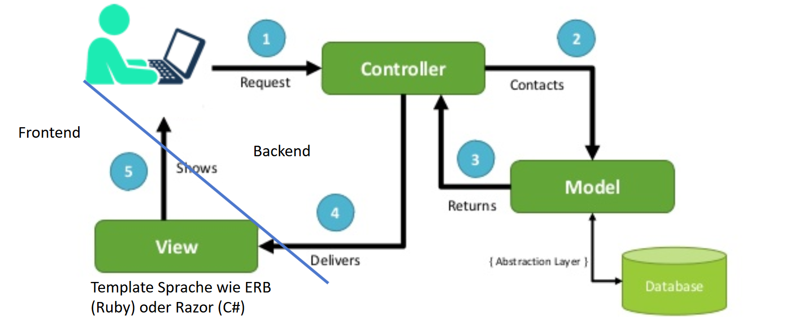
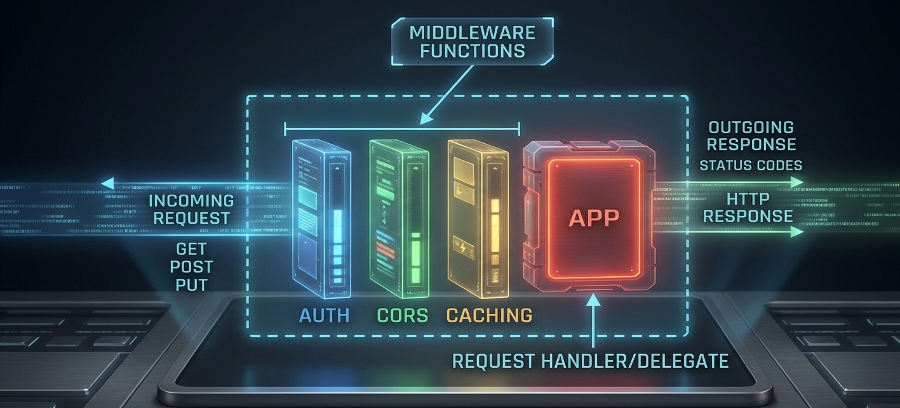

# Backend Basics

---

# Inhaltsverzeichnis

1. MVC
2. REST API
3. RESTful Principles
4. Idempotenz
5. API Dokumentation
6. API Versionierung
7. Business Logic
8. Databases Fundamentals
9. Query Basics

---

# Einleitung

---

## MVC



---

- Model: Repräsentation der Daten
- View: Darstellung der Daten für den Benutzer
- Controller: Vermittler zwischen Model und View, verarbeitet Benutzereingaben; Geschäftslogik
- Früher war View ein HTML-Template, heute ist es oft die REST API. Zusätzlich gibt es dann eine Single Page Application (SPA) als Frontend für Nutzer.
  - zum Beispiel ASP.NET MVC, Spring MVC, Ruby on Rails

---

# REST API

---
## Einleitung
REST (Representational State Transfer)

- Representational: Daten


---

# RESTful **Principles**

Die 6 Leitprinzipien für skalierbare Web-Services nach Roy Fielding

---

## Definition & Ursprung

- **Was ist REST?**
  Representational State Transfer ist kein Protokoll, sondern ein **Architekturstil** für verteilte Hypermedia-Systeme. Er nutzt bestehende Web-Standards (HTTP) optimal aus.

- **Die Herkunft:**
  Das Konzept wurde im Jahr 2000 von **Roy Fielding** in seiner Doktorarbeit vorgestellt. Es beschreibt die Kernmechanismen, die das World Wide Web skalierbar machen.

---

## Die 6 Prinzipien im Überblick

1. **Uniform Interface** (Einheitliche Schnittstelle)
2. **Client-Server** (Klare Trennung der Zuständigkeiten)
3. **Stateless** (Zustandslosigkeit)
4. **Cacheable** (Zwischenspeicherbarkeit)
5. **Layered System** (Mehrschichtige Architektur)
6. **Code on Demand** (Optional: Dynamische Code-Übertragung)

---

## 1. Uniform Interface

Das Uniform Interface ist das zentrale REST-Prinzip: Ressourcen werden über eindeutige URIs adressiert und mit standardisierten HTTP-Methoden bearbeitet.

---

# REST Guiding Principles

Wir beginnen mit einem Überblick über die grundlegenden Prinzipien, die RESTful-Architekturen definieren. Diese Prinzipien, die von Roy Fielding eingeführt wurden, sind der Schlüssel zu skalierbaren und robusten Web-APIs.

---

### 1. Uniform Interface

- **Vorteil:** Das System wird vorhersehbar, einheitlich und extrem einfach erweiterbar.
- **Wie wird es erreicht?** Durch strikte Einhaltung standardisierter Regeln
- **RESTful Design:** Jede URI benennt **Substantive** (Ressourcen), auf die über standardisierte **HTTP-Verben** (wie `GET`, `POST`, `PUT`, `DELETE`) zugegriffen wird.

---

#### Beispiele für das URI-Design:

- `POST /createUser`
- `GET /getUserById?id=45`
- `POST /updateUser/45`
- `GET /deleteUser/45`

_Warum falsch?_ Das HTTP-Protokoll bringt die Aktions-Verben bereits mit. Zusätzliche Verben im Pfad machen die API unübersichtlich und redundant.

- `POST /users` (Nutzer erstellen)
- `GET /users/45` (Nutzer 45 abrufen)
- `PUT /users/45` (Nutzer 45 aktualisieren)
- `DELETE /users/45` (Nutzer 45 löschen)

_Warum richtig?_ Die URI benennt nur das "Was" (die Ressource). Die HTTP-Methode definiert das "Wie" (die Aktion).

---

#### URI-Struktur erklärt

Dies zeigt, wie die verschiedenen Teile einer URI zusammenarbeiten, um Ressourcen zu identifizieren und Aktionen zu steuern.

- **Ressourcenidentifizierung:** Der `path` (Pfad) identifiziert die Ressource. Zum Beispiel `/users` für die Sammlung oder `/users/45` für eine bestimmte Instanz. Hier werden _ausschließlich_ Substantive verwendet.
- **Aktionssteuerung:** Die HTTP-Methode (z. B. `GET` oder `POST`, nicht Teil der URI) bestimmt die eigentliche Aktion.
- **Abfrageparameter:** Der `query` (Abfrage) wird verwendet, um Antworten zu filtern, zu sortieren oder zu paginieren (z. B. `?search=bogdan`). Dies hält die Basis-URIs sauber und übersichtlich.

---

#### Die 4 Uniform-Constraints

- **Ressourcen-Identifizierung:** Jede Ressource ist über eine eindeutige URI ansprechbar (z.B. `GET /api/users/42`).
- **Manipulation durch Repräsentation:** Der Client besitzt nicht die echten DB-Daten, sondern modifiziert Ressourcen via Repräsentationen (JSON, XML).
- **Selbstbeschreibende Nachrichten:** Jeder Request/Response enthält alle Metadaten (Headers), die erklären, wie die Nachricht zu interpretieren ist (z.B. `Content-Type`).
- **HATEOAS:** _Hypermedia as the Engine of Application State_. Der Server liefert Links zu weiteren Aktionen mit.

---

### 2. Client-Server-Trennung

- **Klare Zuständigkeiten:** Das Frontend (Client) kümmert sich ausschließlich um die Benutzeroberfläche und die User Experience. Das Backend (Server) übernimmt Datenhaltung, Sicherheit und Geschäftslogik.

- **Die Stärke:**
  Beide Systeme können unabhängig voneinander weiterentwickelt, skaliert oder technologisch ausgetauscht werden.

---

### 3. Zustandslosigkeit (Stateless)

- **Die Kernregel:** Der Server speichert **keinen** Sitzungskontext (Session-State) über den Client zwischen zwei Anfragen.

- **Jeder Request ist autark:**
  Jede einzelne HTTP-Anfrage muss alle Informationen enthalten, die für das Verstehen und Verarbeiten notwendig sind (z.B. Authentifizierungs-Token im Header).

- **Ergebnis:** Starke Skalierung möglich:
- Ein Session-State (z. B. ein Login-Zustand) würde massiven Overhead erzeugen: Dies müsste im RAM oder in der Datenbank gespeichert werden. Wenn es gar keinen State (Zustand) gibt, kann einfach skaliert werden (= mehr Traffic auf die Webseite).
  - Massives **Load Balancing** wird möglich. Jeder Server im Cluster kann jeden Request sofort verarbeiten.

---

### 4. Cacheable

**Effizienz durch Caching:**
Server-Antworten müssen implizit oder explizit als cachebar deklariert werden. Das spart Bandbreite, schont Server-Ressourcen und senkt die Latenz drastisch.

### 5. Layered System

**Mehrschichtiges System (Layered System):**
Der Client kann nicht wissen, ob er direkt mit dem Endserver oder einem Proxy (= Stellvertreter, z. B. Load Balancer, die Traffic auf verschiedene Server verteilen) kommuniziert. Schichten verbessern die Sicherheit und die Skalierbarkeit.

---

### 6. Code on Demand (Optional)

- **Das Konzept:**
  Der Server kann die Funktionalität des Clients temporär erweitern, indem er ausführbare Logik direkt an ihn überträgt.

- **Praxisbeispiele:**
  - Senden von **JavaScript-Skripten**, die dynamisch im Browser des Nutzers ausgeführt werden.
  - Historisch: Java-Applets oder Flash.

- _Hinweis:_ Dies ist das einzige **optionale** Prinzip. Viele moderne APIs verzichten darauf.

---

### Zusammenfassung der Vorteile

| REST Prinzip          | Primärer Vorteil                                 |
| :-------------------- | :----------------------------------------------- |
| **Uniform Interface** | Einfachheit, Vorhersehbarkeit & Sichtbarkeit     |
| **Stateless**         | Unbegrenzte horizontale Skalierbarkeit           |
| **Client-Server**     | Portabilität der UI & Unabhängigkeit der Systeme |
| **Cacheable**         | Signifikante Steigerung der Netzwerk-Performance |

---

## Idempotenz

> "Eine Operation ist idempotent, wenn sie mehrfach ausgeführt werden kann, ohne dass das Ergebnis über die erste Ausführung hinaus verändert wird."

<div style="display: flex; gap: 40px; margin-top: 30px;">
<div style="flex: 1;">
<h3>Mathematischer Kontext</h3>
<p>Eine Funktion <code>f(x)</code> ist idempotent, wenn gilt:</p>
<p style="text-align: center; font-size: 1.5rem; color: #10b981;"><strong>f(f(x)) = f(x)</strong></p>
<p>Beispiele: Die Multiplikation mit 0 oder die Betragsfunktion <code>abs(x)</code>.</p>
</div>

<div style="flex: 1;">
<h3>HTTP & API Kontext</h3>
<p>Ein Request ist idempotent, wenn der <strong>Zustand auf dem Server</strong> bei identischen Folge-Requests unverändert bleibt.</p>
<p>Wichtig: Der HTTP-Response-Statuscode darf sich ändern, der Zustand der Ressource hingegen nicht.</p>
</div>
</div>

---

### Alltags-Analogie

<div style="display: flex; gap: 40px;">
<div style="flex: 1; background: #0f172a; padding: 25px; border-radius: 12px; border: 1px solid rgba(255,255,255,0.05);">
<h3>🛗 Der Fahrstuhl-Knopf</h3>
<p><strong>Idempotent:</strong> Egal wie oft Sie den Knopf für das 5. Stockwerk drücken: Der Fahrstuhl fährt in das 5. Stockwerk. Das Ergebnis bleibt beim 2. oder 100. Klick absolut identisch.</p>
</div>

<div style="flex: 1; background: #0f172a; padding: 25px; border-radius: 12px; border: 1px solid rgba(255,255,255,0.05);">
<h3>🍫 Der Snack-Automat</h3>
<p><strong>Nicht Idempotent:</strong> Jedes Mal, wenn Sie den Knopf drücken (und bezahlen), fällt ein neuer Snack heraus. Ihr Kontostand sinkt weiter und der Vorrat im Automaten verringert sich.</p>
</div>
</div>

---

### Warum ist das wichtig?

Gefahrlose Retries im Frontend ermöglichen.
In instabilen Netzwerken sind **Retries** (Wiederholungsanfragen) unvermeidlich.

- **Das Problem:** Ein Client sendet einen Request, der Server verarbeitet ihn erfolgreich, aber die Server-Antwort geht auf dem Rückweg im Netzwerk verloren.
- **Die Lösung:** Ist die HTTP-Methode _idempotent_, darf der Client (oder die Axios/Fetch-Logik im Frontend) den Request bei einem Timeout einfach gefahrlos noch einmal senden.
- **Kritischer Anwendungsfall:** "Bestellung abschicken" (meist `POST`) vs. "Zahlungsstatus auf bezahlt setzen" (meist `PUT`). Sie wollen niemals versehentlich Doppelabbuchungen erzeugen.

---

### Methoden-Vergleich im Detail

<div style="display: flex; gap: 40px;">
<div style="flex: 1;">
<h3><code>PUT</code> (Idempotent)</h3>
<p style="color: #34d399;"><code>PUT /users/45</code></p>
<p>Wenn Sie diesen Request 10-mal hintereinander abschicken, wird der Datensatz mit der ID 45 jedes Mal mit exakt denselben Werten überschrieben. Der Endzustand der Datenbank nach dem ersten und dem zehnten Request ist absolut identisch.</p>
</div>

<div style="flex: 1;">
<h3><code>POST</code> (Nicht Idempotent)</h3>
<p style="color: #f87171;"><code>POST /users</code></p>
<p>Wenn Sie diesen Request 10-mal abschicken, erzeugen Sie im schlimmsten Fall 10 identische Nutzer mit 10 verschiedenen IDs in Ihrer Datenbank. Jede Wiederholung verändert den Zustand des Systems.</p>
</div>
</div>

---

# API **Dokumentation**

Der Vertrag zwischen Backend, Frontend und externen Entwicklern

---

## Warum ist API-Dokumentation wichtig?

> "Code beschreibt, wie das System funktioniert. Dokumentation beschreibt, wie man es benutzt, ohne den Code lesen zu müssen."

- **Das Frontend-Problem:** Ohne Dokumentation raten Frontend-Entwickler, welche Datenstrukturen (`Types`) ein Endpoint erwartet oder zurückgibt.
- **Effizienz:** Spart unzählige Slack-Nachrichten und Meetings der Marke _"Wie hieß das Feld für die ID nochmal?"_.
- **Onboarding:** Neue Teammitglieder können sofort autark mit der API arbeiten.

---

## Der moderne Standard: OpenAPI & Swagger

Heute schreibt niemand mehr API-Dokumentation händisch in Word-Dateien. Man nutzt die **OpenAPI-Spezifikation (OAS)**.

- **Was ist OpenAPI?** Ein standardisiertes Format (in JSON oder YAML), das REST-APIs maschinenlesbar beschreibt.
- **Was ist Swagger?**
  Das bekannteste Tooling-Ökosystem, das aus dieser OpenAPI-Datei automatisch eine **interaktive UI** generiert.
- **Der Vorteil:** Entwickler können direkt im Browser Test-Requests an die API senden ("Try it out").

---

## Core-Elemente einer guten Dokumentation

Jeder dokumentierte Endpoint sollte mindestens folgende 4 Informationen liefern:

1. **Basis-Metadaten:** Die HTTP-Methode und der exakte Pfad (z.B. `POST /api/v1/users`).
2. **Request-Parameter:** Welche Daten müssen in den `Query-Params`, den `Headers` oder im `Body` (Payload) mitgeschickt werden?
3. **Response-Beispiele:** Wie sieht das JSON-Objekt im Erfolgsfall (`200 OK` / `210 Created`) exakt aus?
4. **Fehler-Szenarien:** Welche Statuscodes (`400`, `401`, `404`, `500`) gibt es und wie sieht die Fehlermeldung aus?

---

## Dokumentation-Ansätze im Vergleich

<div style="display: flex; gap: 40px;">
<div style="flex: 1;">
<h3>Code-First Approach</h3>
<p>Die Dokumentation wird **direkt im Code** generiert (z.B. über JSDoc, Decorator in NestJS oder Bibliotheken in Next.js).</p>
<p style="color: #34d399;">✔ Bleibt aktuell, da sie nah am Code lebt.</p>
<p style="color: #f87171;">✘ Code kann durch massig Doku-Kommentare unübersichtlich werden.</p>
</div>

<div style="flex: 1;">
<h3>Design-First Approach</h3>
<p>Die API wird **zuerst** in einem Editor (z.B. Stoplight, Swagger Editor) spezifiziert, bevor Code geschrieben wird.</p>
<p style="color: #34d399;">✔ Frontend & Backend können ab Tag 1 parallel arbeiten (Mocking).</p>
<p style="color: #f87171;">✘ Gefahr, dass Code und Doku später auseinanderlaufen.</p>
</div>
</div>

---

## Best Practices für exzellente Docs

- **Nutzen Sie semantische HTTP-Statuscodes:** Dokumentieren Sie nicht nur `200` und `500`. Zeigen Sie dem Frontend exakt, wann ein `422` (Unprocessable Entity) oder ein `409` (Conflict) verwendet wird.
- **Typsicherheit generieren:** Nutzen Sie Tools wie `openapi-typescript`. Damit lässt sich die OpenAPI-Doku einlesen, um automatisch **TypeScript-Typen fürs Frontend** zu generieren.
- **Authentifizierung klarmachen:** Es muss sofort ersichtlich sein, welche Endpoints öffentlich sind und welche ein `Authorization: Bearer <Token>` benötigen.

---

# APIs sind Produkte. **Docs die Verpackung.**

Gute Dokumentation entscheidet über den Erfolg einer Architektur.

<div style="margin-top: 60px; font-size: 1.1rem; color: #64748b;">
OpenAPI | Swagger | Readme.io | Redoc
</div>

---

# API **Versionierung**

Evolution ohne Frustration für Frontend und Clients

---

## Warum brauchen wir Versionierung?

> "Eine API ist ein verbindlicher Vertrag. Bricht das Backend den Vertrag, bricht unweigerlich das Frontend."

Software entwickelt sich weiter, und damit auch die Datenstruktur. Wir versionieren APIs, um **Abwärtskompatibilität (Backward Compatibility)** zu garantieren.

- Wenn eine React-App Version 1 der API nutzt, darf sie nicht abstürzen, nur weil das Backend-Team an Version 2 arbeitet.
- Beide Versionen müssen für eine Übergangszeit **parallel** betrieben werden.

---

## Wann ist eine Versionierung nötig?

Nicht jede Änderung erfordert eine neue API-Version (z.B. `v2`). Wir unterscheiden strikt:

<div style="display: flex; gap: 40px; margin-top: 30px;">
<div style="flex: 1; background: #0f172a; padding: 25px; border-radius: 12px; border: 1px solid rgba(16, 185, 129, 0.3);">
<h3 style="color: #34d399;">✔ Non-Breaking Change</h3>
<p><em>Keine neue Version nötig.</em></p>
<ul style="font-size: 1.1rem;">
  <li>Hinzufügen eines <strong>neuen</strong> Feldes im JSON.</li>
  <li>Hinzufügen eines neuen Endpoints.</li>
  <li>Optionale Query-Parameter hinzufügen.</li>
</ul>
</div>

<div style="flex: 1; background: #0f172a; padding: 25px; border-radius: 12px; border: 1px solid rgba(248, 113, 113, 0.3);">
<h3 style="color: #f87171;">✘ Breaking Change</h3>
<p><em>Neue Version (`v2`) zwingend erforderlich!</em></p>
<ul style="font-size: 1.1rem;">
  <li><strong>Löschen</strong> oder <strong>Umbenennen</strong> von Feldern.</li>
  <li>Ändern des Datentyps (z.B. ID von `Int` auf `String`).</li>
  <li>Neue, verpflichtende Parameter/Payloads.</li>
</ul>
</div>
</div>

---

## Strategie 1: URI-Versionierung (Der Standard)

Die Versionsnummer wird direkt als Präfix in den URL-Pfad geschrieben.

- **Beispiel:** `GET https://api.example.com/v1/users`
- **Vorteile:** \* Extrem einfach zu implementieren und im Browser zu testen.
  - Für Frontend-Entwickler sofort ersichtlich, welche API genutzt wird.
- **Nachteile:**
  - Bricht streng genommen die REST-Prinzipien (Eine Version ist eigentlich keine "Ressource").

---

## Strategie 2 & 3: Query & Header

<div style="display: flex; gap: 40px;">
<div style="flex: 1;">
<h3>Query Parameter</h3>
<p><code>GET /users?version=1</code></p>
<p>Die Version wird als Filter-Parameter an die URI gehängt.</p>
<p style="color: #34d399;">✔ URL-Pfad bleibt sauber.</p>
<p style="color: #f87171;">✘ Verwirrend, da Query-Parameter eigentlich für Dinge wie Suchen/Sortieren gedacht sind.</p>
</div>

<div style="flex: 1;">
<h3>Header (Content Negotiation)</h3>
<p><code>Accept: application/vnd.api.v1+json</code></p>
<p>Der Client fordert über den HTTP-Header eine spezifische Version an.</p>
<p style="color: #34d399;">✔ Der absolut sauberste "pure" REST-Weg.</p>
<p style="color: #f87171;">✘ Schwer zu debuggen, da man die API nicht mehr einfach in die Browser-URL tippen kann.</p>
</div>
</div>

---

## Vergleich der Strategien

| Methode                   | REST Konformität | Entwicklerfreundlichkeit | Caching im Browser |
| :------------------------ | :--------------: | :----------------------: | :----------------: |
| **URI Path** (`/v1/`)     |     Niedrig      |        Sehr hoch         |    Sehr einfach    |
| **Query** (`?v=1`)        |      Mittel      |           Hoch           |        Gut         |
| **Header** (`Accept: v1`) |    Sehr hoch     | Niedrig (Tooling nötig)  |     Komplexer      |

_In der Praxis (z.B. bei Stripe, GitHub oder Twitter) hat sich die **URI-Versionierung** aufgrund der pragmatischen Handhabung klar durchgesetzt._

---

## Best Practices für Versionierung

1. **Halten Sie es simpel:** Nutzen Sie nur Major-Versionen (z. B. `v1`, `v2`). Ein Schema wie `v1.4.2` in der API ist Overkill und führt zu Chaos im Backend-Routing.
2. **Standard-Version definieren:** Wenn ein Client keinen Header oder Pfad angibt, leiten Sie ihn entweder zur ältesten stabilen Version weiter oder geben Sie einen sauberen Error (`400 Bad Request`) zurück.
3. **Graceful Sunset:** Wenn Sie `v1` abschalten, kündigen Sie dies rechtzeitig an (Deprecation Notices). Nutzen Sie in HTTP-Responses den standardisierten `Sunset`-Header mit einem Datum.

---

# Stabile Verträge. **Gute APIs.**

Versionierung ist das Sicherheitsnetz Ihrer Architektur.

<div style="margin-top: 60px; font-size: 1.1rem; color: #64748b;">
URI Path | Query Params | Custom Headers
</div>

---

# Business **Logic**

Vom HTTP-Request zur Datenbank und zurück

---

---

## Die Evolution der Business Logic

Im Grunde genommen macht jedes Backend das Gleiche: Es nimmt einen **HTTP-Request** entgegen, jagt ihn durch die Geschäftslogik und spuckt eine **HTTP-Response** aus. Spannend wird es bei der Frage, wie wir diesen Code strukturieren, wenn die App wächst.

<div class="grid-2">
<div class="tile" style="border-color: rgba(248, 113, 113, 0.3);">
<h3 style="color: #f87171;">Phase 1: Der Prototyp (if / else)</h3>
<p>Man startet mit einer einzigen Datei. Die Routen und die Logik werden direkt untereinander in simplen Verzweigungen abgehandelt. Wenn die URL <code>/users</code> ist, hol den User; wenn sie <code>/products</code> ist, hol das Produkt.</p>
<p><strong>Das Problem:</strong> Sobald Validierung, Error-Handling und Datenbanken dazukommen, bricht dieses File auseinander. Der Code wird unlesbar und lässt sich nicht mehr testen.</p>
</div>

---

<div class="tile" style="border-color: rgba(16, 185, 129, 0.3);">
<h3 style="color: #34d399;">Phase 2: Strukturierte Architektur</h3>
<p>Ab hier bricht man die Riesen-Logik in saubere, wiederverwendbare Bausteine auf. Je nach Team-Präferenz nutzt man dafür einen von zwei Wegen:</p>
<ul>
  <li><strong>Funktionsorientiert:</strong> Reine, entkoppelte Funktionen (z. B. typisch für Express-Controller oder Next.js Route Handler).</li>
  <li><strong>Klassenorientiert (OOP):</strong> Strukturierung über Controller- und Service-Klassen mit Dependency Injection (z. B. der Standard in NestJS).</li>
</ul>
</div>
</div>

---

## Das Middleware & Request Handler Pattern

Um diese Struktur zu erreichen, etablieren moderne Frameworks eine saubere Kette von Verantwortlichkeiten:

- **Middleware:** Eine Funktion, die HTTP-Anfragen abfängt, _bevor_ sie die eigentliche Geschäftslogik erreichen. Sie ist perfekt geeignet, um Requests zu modifizieren, Tokens zu authentifizieren oder Logs zu schreiben.
- **Request Handler:** Die finale Funktion am Ende der Kette. Sie enthält die eigentliche Geschäftslogik (z. B. den Datenbankaufruf) und sendet die fertige HTTP-Antwort (`Response`) an den Client zurück.
- **Request Handler Delegate:** Das Prinzip, diese Bausteine als Pipeline zu organisieren. Jede Middleware entscheidet aktiv, ob sie die Anfrage an den nächsten Block _delegiert_ (`next()`) oder abricht.

---

# Systemarchitektur: **Die Pipeline**

So durchläuft der Request das Backend

<br>



---

## 💻 Aufgabe: Der VIP-Eingang

Erstellen Sie einen simplen Express-Server mit einer geschützten Route. Ziel ist es, die Verantwortlichkeiten strikt zwischen Middleware und Handler zu trennen.

<div class="grid-2">
<div class="tile" style="border-top: 4px solid #f87171;">
<h3>1. Die Middleware (Der Türsteher)</h3>
<p>Schreiben Sie eine Middleware-Funktion <code>checkAuth</code>. Sie prüft, ob der HTTP-Header <code>x-role</code> den Wert <code>"vip"</code> hat.</p>
<ul>
  <li>Wenn ja: Leiten Sie die Anfrage weiter.</li>
  <li>Wenn nein: Blockieren Sie die Anfrage mit Status <code>403 Forbidden</code> und einer Fehlermeldung.</li>
</ul>
</div>

---

<div class="tile" style="border-top: 4px solid #34d399;">
<h3>2. Der Request Handler (Die Party)</h3>
<p>Schreiben Sie eine Handler-Funktion <code>getVipData</code>. Diese wird nur aufgerufen, wenn die Middleware die Anfrage durchlässt.</p>
<ul>
  <li>Senden Sie den Status <code>200 OK</code>.</li>
  <li>Schicken Sie ein JSON-Objekt zurück: <code>{ message: "Willkommen in der VIP-Lounge!" }</code></li>
</ul>
</div>
</div>

**Route:** Verknüpfen Sie beide Funktionen auf der Route `GET /api/vip`.

---

## ✅ Musterlösung

So sieht die saubere Trennung im Code aus:

```javascript
const express = require("express");
const app = express();

// 1. Middleware: Kontrolliert den Zugang
const checkAuth = (req, res, next) => {
  const role = req.headers["x-role"];

  if (role === "vip") {
    next(); // Erfolgreich: Delegiere an den nächsten Handler
  } else {
    // Abbruch: Der Request endet hier, der Handler wird nie erreicht
    res.status(403).json({ error: "Zugriff verweigert. Nur für VIPs!" });
  }
};

// 2. Request Handler: Kümmert sich nur um die Business Logik
const getVipData = (req, res) => {
  res.status(200).json({ message: "Willkommen in der VIP-Lounge!" });
};

// Verknüpfung der Pipeline
app.get("/api/vip", checkAuth, getVipData);

app.listen(3000, () => console.log("Server läuft auf Port 3000"));
```


---

# API Architektur & **Modellierung**

Struktur, Verhalten und Implementierungs-Stile

---

## Das "Duo" der Backend-Architektur

Um eine professionelle REST-API zu bauen, trennen wir zwischen der **technischen Struktur** und dem **logischen Ablauf**:

<div class="grid-2">
<div class="tile">
<h3>1. Die Struktur</h3>
<p>Das <strong>Middleware & Request Handler Pattern</strong> bildet das Skelett der API. Es definiert, wie ein Request die technische Pipeline (Auth, Validierung, Logging) durchläuft, bevor er die Logik erreicht.</p>
</div>

<div class="tile">
<h3>2. Das Verhalten</h3>
<p><strong>Sequenzdiagramme</strong> modellieren die eigentliche Business Logic. Sie zeigen visuell, wie Daten zwischen Middleware, Handlern, Services und Datenbanken fließen.</p>
</div>
</div>

---

## Modellierung mit Sequenzdiagrammen

Warum sind Sequenzdiagramme das perfekte Werkzeug für das Middleware-Pattern? Weil HTTP-Anfragen von Natur aus **sequentiell** ablaufen.

> Das Diagramm zeigt nicht "Wie wird sortiert?", sondern "**Wer spricht wann mit wem?**"

- **Visualisierung der Kette:** Man sieht sofort, wo eine Middleware den Request abbricht (z. B. 401 Unauthorized).
- **Zuständigkeiten:** Es wird klar, welche Komponente für die Datenvalidierung zuständig ist und welche für den Datenbank-Query.
- **Schnittstellen:** Die Pfeile im Diagramm definieren die Methoden-Aufrufe oder Funktions-Parameter.

---

## Architekturstile: FP vs. OOP

Beide Patterns (Middleware & Sequenz-Modellierung) funktionieren unabhängig vom gewählten Programmierstil. Der Unterschied liegt nur in der **Art der Bausteine**.

<div class="grid-2">
<div class="tile" style="border-top: 4px solid #10b981;">
<h3>Funktionsorientiert (FP)</h3>
<p>Typisch für <strong>Express.js</strong>.</p>
<ul>
  <li>Bausteine im Diagramm sind <strong>reine Funktionen</strong>.</li>
  <li>Der Request-Status wird als Datenobjekt durch eine Kette (Pipe) gereicht.</li>
  <li><code>req -> func1 -> func2 -> res</code></li>
</ul>
</div>

---

<div class="tile" style="border-top: 4px solid #10b981;">
<h3>Objektorientiert (OOP)</h3>
<p>Standard in <strong>NestJS / Spring Boot</strong>.</p>
<ul>
  <li>Bausteine im Diagramm sind <strong>Instanzen von Klassen</strong> (Objekte).</li>
  <li>Der Request triggert Methoden auf Objekten (Controller, Services, Guards).</li>
  <li><code>ObjectA.method() -> ObjectB.call()</code></li>
</ul>
</div>
</div>

---

## Zusammenfassung

1. Das **Middleware-Pattern** ist das infrastrukturelle Gerüst (Die Pipeline).
2. Das **Sequenzdiagramm** ist der Bauplan für den Datenfluss (Die Logik).
3. **FP oder OOP** sind lediglich die Werkzeuge, mit denen wir diese Architektur im Code umsetzen.

**Egal welcher Stil:** Das Ziel ist die Entkopplung von technischer Infrastruktur und fachlicher Business Logic.

---

# Databases **Fundamentals**

Die Grundlage für persistente Daten und stabile Geschäftsdomänen

---

## SQL vs. NoSQL: Die zwei Welten

Datenbanken werden grundlegend in **relationale (SQL)** und **nicht-tabellarische (NoSQL)** Systeme unterteilt. Im echten Entwickleralltag überwiegt meist der relationale Ansatz, da sich Business-Logiken hervorragend über feste Beziehungen abbilden lassen.

<div class="grid-2">
<div class="tile" style="border-left: 4px solid #3b82f6;">
<h3 style="color: #60a5fa;">SQL (Relational)</h3>
<ul>
  <li>Basiert auf strikten <strong>Beziehungen</strong></li>
  <li>Festes, vordefiniertes <strong>Schema</strong></li>
  <li>Geringere Roh-Performance</li>
  <li>Schwieriger horizontal zu skalieren</li>
  <li><em>Tech-Stack:</em> PostgreSQL, MySQL</li>
</ul>
</div>

---

<div class="tile" style="border-left: 4px solid #a855f7;">
<h3 style="color: #c084fc;">NoSQL (Non-Tabular)</h3>
<ul>
  <li>Keine starre Form (<strong>Schemalos</strong>)</li>
  <li>Eingeschränkte Beziehungslogik</li>
  <li>Sehr hohe Performance</li>
  <li>Hervorragend horizontal skalierbar</li>
  <li><em>Tech-Stack:</em> MongoDB, Neo4j</li>
</ul>
</div>
</div>

---

## Wann nutzt man was?

Die Wahl des Datenbanksystems hängt von den Anforderungen der Anwendung ab:

| Kriterium     | SQL-Datenbanken                   | NoSQL-Datenbanken                     |
| :------------ | :-------------------------------- | :------------------------------------ |
| **Fokus**     | Komplexe Beziehungen wichtig      | Maximale Performance & Durchsatz      |
| **Schema**    | Benötigt ein verlässliches Schema | Flexibel für unstrukturierte Daten    |
| **Beispiele** | E-Commerce-Systeme, Banking       | Content-Management (CMS), Log-Storage |

---

## 💻 Aufgabe:

Um in technischen Screenings und Live-Coding-Interviews zu bestehen, müssen beide Konzepte praktisch beherrscht werden:

- **SQL Practice:**
  - Sie müssen SQL-Queries nicht zwingend auswendig im Schlaf schreiben können, aber das Verständnis für relationale Operationen ist Pflicht.
  - **Fokus im Interview:** Beherrschen Sie `INNER JOIN` und `LEFT JOIN` sicher auf einfachem bis mittlerem Schwierigkeitsgrad.
- **NoSQL (MongoDB) Practice:**
  - Machen Sie sich mit dokumentenorientierten Abfragen vertraut.
  - Nutzen Sie Tools wie `humongous.io`, um grundlegende CRUD-Queries gegen eine Live-NoSQL-Datenbank auszuführen und sich auf typische Screening-Fragen vorzubereiten.

# Query (Abfrage) **Basics**

Wie wir mit Datenbanken kommunizieren: SQL vs. NoSQL

---

## Die zwei Sprachen der Datenbeschaffung

Egal welche Architektur: Im Kern geht es immer um **CRUD** (Create, Read, Update, Delete). Aber _wie_ wir diese Anfragen (Queries) formulieren, unterscheidet sich fundamental:

<div class="grid-2">
<div class="tile" style="border-left: 4px solid #3b82f6;">
<h3 style="color: #60a5fa;">Der SQL-Ansatz</h3>
<p><strong>Deklarativ:</strong> Sie beschreiben exakt, <em>was</em> Sie haben wollen, aber nicht, wie die Datenbank es intern beschafft. Die Syntax ist eine eigene, englisch-ähnliche Sprache (Structured Query Language).</p>
</div>

<div class="tile" style="border-left: 4px solid #a855f7;">
<h3 style="color: #c084fc;">Der NoSQL-Ansatz</h3>
<p><strong>Prozedural / Objektbasiert:</strong> (Am Beispiel MongoDB). Sie rufen Methoden auf Collections auf und übergeben Filterbedingungen als JSON-Objekte. Das fühlt sich für JavaScript-Entwickler extrem vertraut an.</p>
</div>
</div>

---

## 🔍 SQL Query Basics

Die Anatomie einer Standard-SQL-Abfrage besteht fast immer aus denselben Klauseln:

- `SELECT`: Bestimmt, **welche Spalten** zurückgegeben werden.
- `FROM`: Bestimmt, aus **welcher Tabelle** gelesen wird.
- `WHERE`: Die **Filterbedingung** (z.B. ID, Status, Datum).
- `JOIN`: Verknüpft Datensätze aus **zwei Tabellen** anhand einer gemeinsamen ID.

```sql
-- Hole Namen und Email aller aktiven User über 18
SELECT first_name, email
FROM users
WHERE age > 18 AND status = 'active';

```

---

## 📄 NoSQL Query Basics (MongoDB)

In MongoDB arbeiten wir nicht mit Tabellen und Zeilen, sondern mit **Collections** und **Dokumenten** (im Grunde JSON-Objekte).

- `db.collection.find()`: Die Standardmethode zum Lesen.
- **Filter-Objekt:** Das erste Argument ist ein Objekt mit den Filter-Bedingungen.
- **Operatoren:** Statt `>`, `<` oder `=` nutzen wir spezielle Keys wie `$gt` (greater than) oder `$eq` (equal).

```javascript
// Exakt gleiche Logik wie die SQL-Query zuvor
db.users.find(
  { age: { $gt: 18 }, status: "active" }, // Filter (WHERE)
  { first_name: 1, email: 1, _id: 0 }, // Projection (SELECT)
);
```

---

## ⚔️ CRUD: Der direkte Syntax-Vergleich

| Operation  | SQL (Relational)                           | MongoDB (NoSQL)                                         |
| ---------- | ------------------------------------------ | ------------------------------------------------------- |
| **CREATE** | `INSERT INTO users (name) VALUES ('Tom');` | `db.users.insertOne({ name: 'Tom' })`                   |
| **READ**   | `SELECT * FROM users;`                     | `db.users.find({})`                                     |
| **UPDATE** | `UPDATE users SET age = 20 WHERE id = 1;`  | `db.users.updateOne({ _id: 1 }, { $set: { age: 20 } })` |
| **DELETE** | `DELETE FROM users WHERE id = 1;`          | `db.users.deleteOne({ _id: 1 })`                        |

> Fällt etwas auf? SQL ist textbasiert und starr. MongoDB-Queries sind reine Datenstrukturen (JSON/BSON), die sich im Backend (z.B. in Express.js) direkt dynamisch zusammenbauen lassen.

---

## Das "Join" Problem

Der größte funktionale Unterschied beim Schreiben von Queries:

- **SQL ist fürs Verknüpfen gebaut:** Ein `INNER JOIN` in SQL ist hochoptimiert und der absolute Standardweg, um z. B. einen User mit seinen Bestellungen zu verknüpfen.
- **NoSQL speichert Daten zusammen:** In MongoDB gibt es zwar `$lookup` (eine Art Join), aber eigentlich speichert man Daten, die oft zusammen abgerufen werden, direkt **in einem einzigen verschachtelten Dokument**. Man modelliert die Datenbank nach den Queries, nicht nach Beziehungen.

---

# Daten abfragen ist **Logik.**

## Das Tool entscheidet nur über die Syntax.

---

## 💻 Aufgabe:

- **SQL Practice:**
  - Sie müssen SQL-Queries nicht zwingend auswendig im Schlaf schreiben können, aber das Verständnis für relationale Operationen ist Pflicht.
  - **Fokus im Interview:** Beherrschen Sie `INNER JOIN` und `LEFT JOIN` sicher auf einfachem bis mittlerem Schwierigkeitsgrad.
- **NoSQL (MongoDB) Practice:**
  - Machen Sie sich mit dokumentenorientierten Abfragen vertraut.
  - Nutzen Sie Tools wie `humongous.io`, um grundlegende CRUD-Queries gegen eine Live-NoSQL-Datenbank auszuführen und sich auf typische Screening-Fragen vorzubereiten.

---

## Das SQL-Datenbankschema

In der relationalen Welt ist das **Schema** das Fundament der Datenintegrität. Es beschreibt exakt die Struktur und die Datentypen aller Entitäten.

> "Ein Schema macht Datenbankabfragen verlässlich, typsicher und vorhersagbar."

- **Sicherer Vertrag:** Änderungen am Datenmodell erfordern explizite Migrationen (Hinzufügen von Tabellen, Spalten oder neuen Fremdschlüssel-Beziehungen).
- **Visuelle Modellierung:** Beziehungen zwischen Entitäten (z. B. wie ein `actor` mit `movies` verknüpft ist oder wo `movie_reviews` andocken) werden in Entity-Relationship-Diagrammen (ERD) strukturiert.

---

# Daten halten. **Struktur bewahren.**

Die Wahl der Datenbank bestimmt das Schicksal der Skalierung.

<div style="margin-top: 60px; font-size: 1.1rem; color: #64748b;">
PostgreSQL | MongoDB | ERD | Schema Design
</div>

---

## ORM
