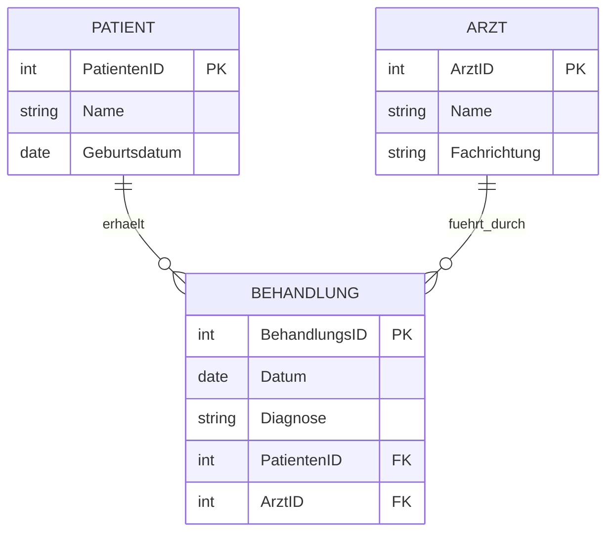
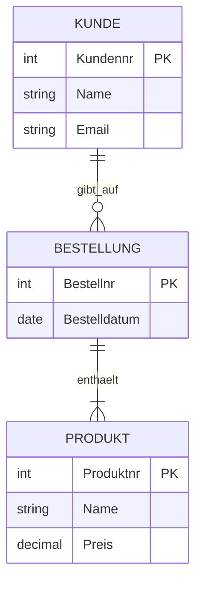
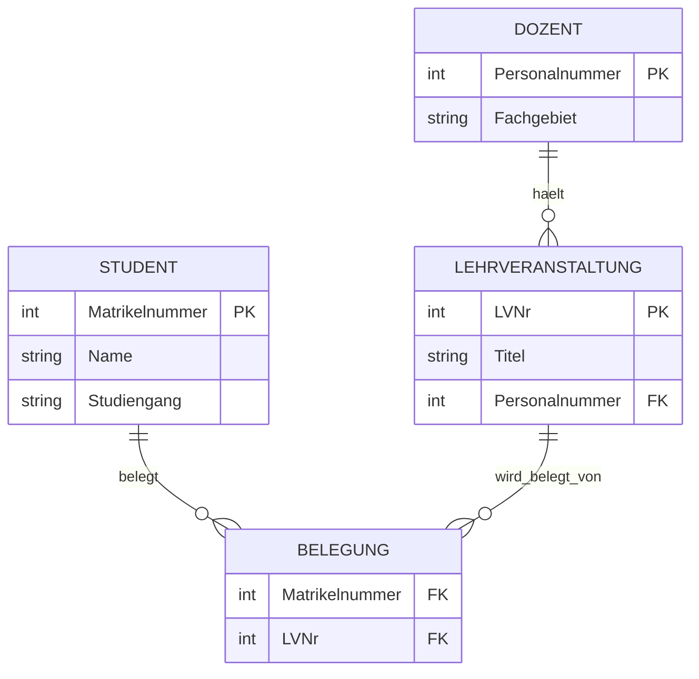
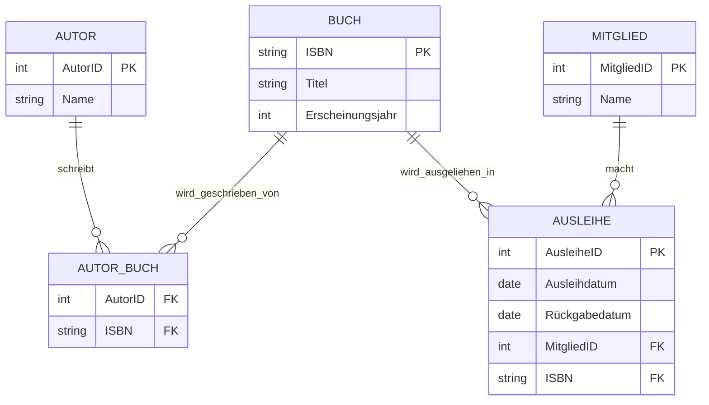

## Aufgabe 1 – Krankenhaus

```mermaid
erDiagram

    PATIENT ||--o{ BEHANDLUNG : erhaelt
    ARZT ||--o{ BEHANDLUNG : fuehrt_durch

    PATIENT {
        int PatientenID PK
        string Name
        date Geburtsdatum
    }

    ARZT {
        int ArztID PK
        string Name
        string Fachrichtung
    }

    BEHANDLUNG {
        int BehandlungsID PK
        date Datum
        string Diagnose
        int PatientenID FK
        int ArztID FK
    }
```

---

## Aufgabe 2 – Online-Shop

```mermaid
erDiagram

    KUNDE ||--o{ BESTELLUNG : gibt_auf
    BESTELLUNG ||--|{ PRODUKT : enthaelt

    KUNDE {
        int Kundennr PK
        string Name
        string Email
    }

    BESTELLUNG {
        int Bestellnr PK
        date Bestelldatum
    }

    PRODUKT {
        int Produktnr PK
        string Name
        decimal Preis
    }


```

---

## Aufgabe 3 – Universität

```mermaid id="univ3_er"
erDiagram

    STUDENT ||--o{ BELEGUNG : belegt
    LEHRVERANSTALTUNG ||--o{ BELEGUNG : wird_belegt_von

    DOZENT ||--o{ LEHRVERANSTALTUNG : haelt

    STUDENT {
        int Matrikelnummer PK
        string Name
        string Studiengang
    }

    DOZENT {
        int Personalnummer PK
        string Fachgebiet
    }

    LEHRVERANSTALTUNG {
        int LVNr PK
        string Titel
        int Personalnummer FK
    }

    BELEGUNG {
        int Matrikelnummer FK
        int LVNr FK
    }
```

---

## Aufgabe 4 – Bibliothek

```mermaid
erDiagram

    AUTOR ||--o{ AUTOR_BUCH : schreibt
    BUCH ||--o{ AUTOR_BUCH : wird_geschrieben_von

    MITGLIED ||--o{ AUSLEIHE : macht
    BUCH ||--o{ AUSLEIHE : wird_ausgeliehen_in

    AUTOR {
        int AutorID PK
        string Name
    }

    BUCH {
        string ISBN PK
        string Titel
        int Erscheinungsjahr
    }

    MITGLIED {
        int MitgliedID PK
        string Name
    }

    AUTOR_BUCH {
        int AutorID FK
        string ISBN FK
    }

    AUSLEIHE {
        int AusleiheID PK
        date Ausleihdatum
        date Rückgabedatum
        int MitgliedID FK
        string ISBN FK
    }
```
