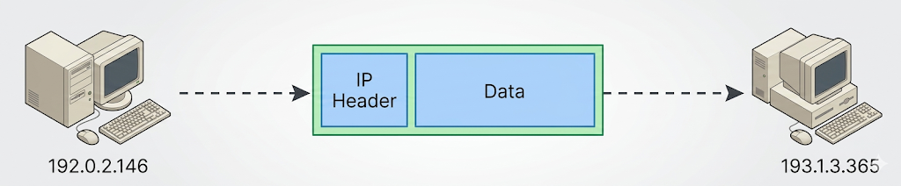
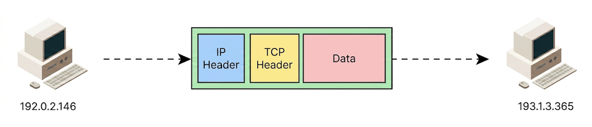
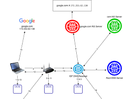
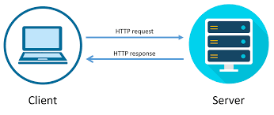

# Wiederholung Web Basics

## Internet Protocol

- Internet Protocol (IP) ist ein Protokoll, das die Adressierung und Weiterleitung von Datenpaketen im Internet ermöglicht.
- Es gibt zwei Versionen von IP: IPv4 und IPv6.
- IPv4 verwendet 32-Bit-Adressen, während IPv6 128-Bit-Adressen verwendet, um die wachsende Anzahl von Geräten im Internet zu unterstützen.
- IP-Adressen werden in der Regel in vier Oktetten dargestellt, z.B.
  - IPv4: `192.168.1.1`
  - IPv6: `2001:0db8:85a3:0000:0000:8a2e:0370:7334`
  - IP-Adressen können statisch oder dynamisch zugewiesen werden, abhängig von der Netzwerkkonfiguration.
- IP-Adressen können auch in privaten Netzwerken verwendet werden, die nicht direkt mit dem Internet verbunden sind, z.B. `192.168.x.x` oder `10.x.x.x`.

---

- IP-Adressen können auch in Kombination mit Subnetzen verwendet werden, um Netzwerke zu segmentieren und die Verwaltung zu erleichtern.
- IP operiert auf der Netzwerkschicht des OSI-Modells und ermöglicht die Kommunikation zwischen Geräten in verschiedenen Netzwerken.
- Ein IP Paket besteht aus einem Header (metadata oder Daten über Daten), der Informationen über die Quelle und das Ziel enthält, sowie einem Payload, der die eigentlichen Daten enthält.
  

---

## TCP Protocol

- Transmission Control Protocol (TCP) ist ein verbindungsorientiertes Protokoll, das eine zuverlässige Datenübertragung zwischen zwei Endpunkten ermöglicht.
- TCP verwendet eine Handshake-Mechanismus, um eine Verbindung zwischen Sender und Empfänger herzustellen, bevor Daten übertragen werden.
- TCP garantiert die Reihenfolge der Datenpakete und stellt sicher, dass alle Pakete korrekt empfangen werden, indem es Bestätigungen (ACKs) verwendet.
- TCP verwendet auch Flusskontrolle und Staukontrolle, um die Übertragungsgeschwindigkeit zu regulieren und Netzwerküberlastungen zu vermeiden.
- TCP ist eines der Hauptprotokolle, die im Internet verwendet werden, insbesondere für Anwendungen wie Webbrowser, E-Mail und Dateiübertragungen.

---

- TCP arbeitet auf der Transportschicht des OSI-Modells und verwendet Portnummern, um verschiedene Anwendungen zu identifizieren, z.B. Port 80 für HTTP und Port 443 für HTTPS.
- TCP ist ein zuverlässiges Protokoll, aber es kann aufgrund von Verbindungsproblemen oder Netzwerküberlastungen zu Verzögerungen kommen. In solchen Fällen kann das User Datagram Protocol (UDP) als Alternative verwendet werden, das eine schnellere, aber unzuverlässige Datenübertragung ermöglicht.



---

## DNS

- Domain Name System (DNS) ist ein hierarchisches und dezentralisiertes System, das die Übersetzung von menschenlesbaren Domainnamen in IP-Adressen ermöglicht.
- DNS besteht aus verschiedenen Komponenten, darunter:
  - DNS-Resolver: Ein Client, der DNS-Anfragen stellt, um die IP-Adresse eines Domainnamens zu erhalten.
  - DNS-Server: Ein Server, der DNS-Anfragen empfängt und beantwortet. Es gibt verschiedene Arten von DNS-Servern, darunter autoritative Server, rekursive Server und Root-Server.
  - DNS-Zonen: Eine DNS-Zone ist ein Teil des DNS-Namensraums, der von einem bestimmten DNS-Server verwaltet wird. Jede Zone enthält Informationen über die Domainnamen und deren zugehörige IP-Adressen.
  - DNS-Einträge: DNS-Einträge sind Datensätze, die Informationen über Domainnamen und deren zugehörige IP-Adressen enthalten. Es gibt verschiedene Arten von DNS-Einträgen, darunter A-Einträge (IPv4-Adressen), AAAA-Einträge (IPv6-Adressen), CNAME-Einträge (Aliasnamen) und MX-Einträge (Mail-Exchanger).
- DNS ist ein wichtiger Bestandteil des Internets, da es die Benutzerfreundlichkeit verbessert, indem es ermöglicht, Domainnamen anstelle von IP-Adressen zu verwenden, um auf Websites und andere Online-Dienste zuzugreifen.
- DNS ist auch anfällig für Angriffe wie DNS-Spoofing und DDoS-Angriffe, weshalb Sicherheitsmaßnahmen wie DNSSEC (DNS Security Extensions) implementiert wurden, um die Integrität und Authentizität von DNS-Daten zu gewährleisten.

---

- DNS ist ein hierarchisches System, das aus verschiedenen Ebenen besteht, darunter die Root-Ebene, die Top-Level-Domain (TLD)-Ebene und die Second-Level-Domain (SLD)-Ebene. Jede Ebene hat ihre eigenen DNS-Server, die für die Verwaltung der entsprechenden Domainnamen verantwortlich sind.
- DNS-Anfragen werden in der Regel über das User Datagram Protocol (UDP) gesendet, können aber auch über das Transmission Control Protocol (TCP) gesendet werden, insbesondere für größere DNS-Antworten oder bei DNSSEC-Implementierungen.
- DNS ist ein kritischer Bestandteil der Internetinfrastruktur, und Ausfälle oder Angriffe auf DNS-Server können zu erheblichen Störungen im Internet führen, weshalb die Sicherheit und Zuverlässigkeit von DNS von großer Bedeutung sind.
- DNS ist auch ein wichtiger Bestandteil von Content Delivery Networks (CDNs), die DNS verwenden, um Benutzeranfragen an den nächstgelegenen Server weiterzuleiten, um die Ladezeiten von Websites zu verbessern und die Leistung zu optimieren.

---


https://itnext.io/dns-the-best-explanation-ever-hopefully-13cea019b72b

---

## HTTP

- Hypertext Transfer Protocol (HTTP) ist ein Protokoll, das die Kommunikation zwischen Webbrowsern und Webservern ermöglicht.
- HTTP ist ein zustandsloses Protokoll, was bedeutet, dass jede Anfrage unabhängig von vorherigen Anfragen behandelt wird.
- HTTP ist auch die Grundlage für andere Protokolle wie HTTPS (HTTP Secure), das eine sichere Kommunikation über das Internet ermöglicht, indem es SSL/TLS-Verschlüsselung verwendet, um die Vertraulichkeit und Integrität der übertragenen Daten zu gewährleisten.
- HTTP ist ein offenes Protokoll, das von der Internet Engineering Task Force (IETF) standardisiert wird, und es gibt viele Implementierungen von HTTP-Servern und -Clients, die in verschiedenen Programmiersprachen und Plattformen verfügbar sind.

---

- HTTP ist ein wichtiger Bestandteil der modernen Webentwicklung, und das Verständnis von HTTP ist entscheidend für die Entwicklung von Webanwendungen, die effizient und sicher sind.
- HTTP ist auch ein wichtiger Bestandteil von APIs (Application Programming Interfaces), die es Entwicklern ermöglichen, auf Funktionen und Daten von Webdiensten zuzugreifen und diese zu nutzen, um innovative Anwendungen und Dienste zu erstellen.

---

## HTTP Requests/ Responses

- HTTP arbeitet auf der Anwendungsschicht des OSI-Modells. Es gruppiert mehrere TCP oder UDP Pakages in ein Request und Reponse Objekt. Somit wird die Entwicjklung von Webanwendungen vereinfacht, da Entwickler (wir!) sich nicht um unterliegende Netzwerkschichten kümmern müssen.
  

- Sowohl HTTP-Anfragen als auch HTTP-Antworten bestehen aus einem HTTP-BODY (optional), der Daten enthält einem und HTTP-HEADER, der die Anfrage/Antwort selbst beschreiben (Ursprung, Codierung, Sicherheit, Caching, Inhaltstyp).

---

### Der HTTP-Request (Die Anfrage)

Das schickt dein Browser (oder deine React-App via `fetch`), wenn ein Nutzer eine Webseite aufruft. Im Prinzip ist es en simples Textdokument, welches dann interpretiert wird.

```http
GET /artikel/http-basics HTTP/1.1
Host: www.theseniordev.de
User-Agent: Mozilla/5.0 (Windows NT 10.0; Win64; x64)
Accept-Language: de-DE,de;q=0.9
Connection: keep-alive
```

---

#### 🔍 Die Komponenten des Requests:

- **1. Request-Line (Startzeile):** Die allererste Zeile. Sie besteht aus drei Teilen:
- **Methode:** `GET` (Was soll passieren? Hier: Daten abrufen. Andere wären POST, PUT, DELETE).
- **Ziel (URI/Pfad):** `/artikel/http-basics` (Welche Ressource wird gesucht?).
- **Protokollversion:** `HTTP/1.1` (Welche HTTP-Version wird gesprochen?).

- **2. Header (Kopfzeilen):** Alles ab der zweiten Zeile bis zur Leerzeile. Es sind Metadaten in Form von `Schlüssel: Wert`-Paaren.
- _Host:_ An welchen Server richtet sich die Anfrage? (Zwingend erforderlich in HTTP/1.1).
- _User-Agent:_ Wer fragt an? (Infos über den Browser und das Betriebssystem).
- _Accept-Language:_ Welche Sprachen bevorzugt der Client?

- **3. Leerzeile (Blank Line):** Ein extrem wichtiges unsichtbares Element (`\r\n`). Sie signalisiert dem Server: _"Hier enden die Header, jetzt kommt nichts mehr (oder es folgt der Body)."_
- **4. Message Body (Nachrichtenrumpf):** Bei einem `GET`-Request meistens leer (wie in diesem Beispiel). Bei einem `POST`- oder `PUT`-Request würden hier die eigentlichen Daten stehen (z. B. ein JSON-Objekt aus einem Formular).

---

### Die HTTP-Response (Die Antwort)

Das schickt der Server zurück an den Client.

```http
HTTP/1.1 200 OK
Date: Sun, 24 May 2026 19:17:00 GMT
Server: Apache/2.4.41 (Ubuntu)
Content-Type: text/html; charset=UTF-8
Content-Length: 138

<!DOCTYPE html>
<html lang="de">
<head><title>HTTP Basics</title></head>
<body><h1>Willkommen zum HTTP-Tutorial!</h1></body>
</html>
```

---

#### 🔍 Die Komponenten der Response:

- **1. Status-Line (Statuszeile):** Die erste Zeile der Antwort. Auch sie hat drei Teile:
- **Protokollversion:** `HTTP/1.1`
- **Status Code:** `200` (Das maschinenlesbare Ergebnis. 2xx = Erfolg, 4xx = Client-Fehler, 5xx = Server-Fehler).
- **Reason Phrase:** `OK` (Die menschenlesbare Beschreibung des Codes, z. B. "OK" oder "Not Found").

- **2. Header (Kopfzeilen):** Wieder Metadaten, diesmal vom Server.
- _Content-Type:_ Extrem wichtig! Sagt dem Browser, wie er den Body interpretieren soll (Hier: Als HTML-Dokument. Könnte auch `application/json` für eine API sein).
- _Content-Length:_ Die Größe des Bodys in Bytes.
- _Server:_ Verrät (optional), welche Software der Server nutzt.

- **3. Leerzeile (Blank Line):** Trennt strikt die Header von den tatsächlichen Nutzdaten.
- **4. Message Body (Nachrichtenrumpf):** Die eigentlichen Nutzdaten der Antwort. In diesem Fall der HTML-Code, den der Browser rendern soll.

---

### HTTP Methoden

HTTP verwendet verschiedene Methoden, um Aktionen auf Ressourcen durchzuführen:

- **GET** - liest eine Ressource
- **POST** - erstellt eine neue Ressource
- **PUT** - aktualisiert eine bestehende Ressource, indem es die gesamte Ressource ersetzt
- **PATCH** - aktualisiert teilweise eine bestehende Ressource, indem es nur die angegebenen Felder ändert
- **DELETE** - löscht eine Ressource

---

### HTTP Statuscodes

HTTP verwendet Statuscodes, um den Erfolg oder Fehler einer Anfrage anzuzeigen

- **1xx** - Informational: Die Anfrage wurde empfangen und wird weiterverarbeitet, z.B. 100 Continue oder 101 Switching Protocols
- **2xx** - Success: Die Anfrage wurde erfolgreich verarbeitet, z.B. 200 OK oder 201 Created
- **3xx** - Redirection: Weitere Aktionen sind erforderlich, um die Anfrage abzuschließen, z.B. 301 Moved Permanently oder 302 Found
- **4xx** - Client Error: Es gab einen Fehler in der Anfrage des Clients, z.B. 400 Bad Request oder 404 Not Found
- **5xx** - Server Error: Es gab einen Fehler auf dem Server, der die Anfrage nicht verarbeiten konnte, z.B. 500 Internal Server Error oder 503 Service Unavailable

---

### HTTP Versionen

- HTTP/1.1 ist die am weitesten verbreitete Version von HTTP, die seit den 1990er Jahren verwendet wird und grundlegende Funktionen wie persistent connections, chunked transfer encoding und pipelining bietet, um die Leistung von Webanwendungen zu verbessern.
- HTTP/2 ist eine neuere Version von HTTP, die Verbesserungen in der Leistung und Effizienz bietet, z.B. durch die Verwendung von Multiplexing, Header-Komprimierung und Server-Push-Techniken, um die Ladezeiten von Websites zu reduzieren und die Benutzererfahrung zu verbessern.
- HTTP/3 ist die neueste Version von HTTP, die auf dem QUIC-Protokoll basiert und weitere Verbesserungen in der Leistung und Sicherheit bietet, z.B. durch die Verwendung von UDP anstelle von TCP, um die Latenz zu reduzieren und die Verbindungssicherheit zu erhöhen.

---

# HTTP Advanced

## Content Negotiation

Das Zusammenspiel dieser drei Konzepte ist im Grunde ein ständiger Dialog zwischen dem Client (z. B. einem Browser oder einer React-App) und dem Server. Das Ziel: Daten so effizient, passgenau und schnell wie möglich zu übertragen.

Man kann es sich wie eine Bestellung im Restaurant vorstellen: Du sagst dem Kellner, was du gerne hättest und ob du Allergien hast (**Content Negotiation**). Der Koch bereitet das Essen zu, verpackt es platzsparend für den Transport (**Content Compression**) und klebt ein Etikett auf die Box, damit du weißt, was drin ist (**Content Type**).

Im Folgenden ist die genaue Aufschlüsselung, wie diese drei Komponenten ineinandergreifen:

---

### 1. Content Negotiation (Die Verhandlung)

Bevor der Server überhaupt Daten schickt, teilt der Client ihm mit, was er _versteht_ und was er _bevorzugt_. Das passiert direkt im HTTP-Request über verschiedene `Accept`-Header. Der Client eröffnet also die Verhandlung.

- **`Accept`:** "Ich hätte gerne HTML, nehme aber auch reines JSON." (z. B. `Accept: text/html, application/json`)
- **`Accept-Encoding`:** "Ich beherrsche folgende Komprimierungsverfahren: Brotli und Gzip." (z. B. `Accept-Encoding: gzip, deflate, br`)
- **`Accept-Language`:** "Am liebsten auf Deutsch, Englisch geht zur Not auch." (z. B. `Accept-Language: de-DE, en-US;q=0.8`)

---

### 2. Content Type (Das tatsächliche Format)

Nachdem der Server den "Wunschzettel" (Content Negotiation) gelesen hat, entscheidet er, was er zurückschickt. Der Server packt die Daten zusammen und muss dem Client nun exakt sagen, um welches Datenformat es sich handelt, damit der Browser (oder dein JavaScript-Code) weiß, wie er die Bytes interpretieren muss.

- Im Response-Header: **`Content-Type: application/json; charset=utf-8`**
- **Der Zusammenhang:** Der `Content-Type` in der Response ist die direkte Antwort auf den `Accept`-Header im Request.
- [Media types (MIME types)](https://developer.mozilla.org/en-US/docs/Web/HTTP/Guides/MIME_types) `Content-Type: type/subtype;parameter=value`
  - type: Hauptkategorie (z. B. `text`, `application`, `image`)
  - subtype: Spezifisches Format (z. B. `html`, `json`, `png`)
  - parameter: Zusätzliche Informationen (z. B. `charset=utf-8`)

---

### 3. Content Compression / Encoding (Die Transport-Optimierung)

Da Netzwerkanfragen teuer sind (Ladezeit, Bandbreite), entscheidet der Server oft, die Daten vor dem Senden zu komprimieren (z. B. eine große JSON-Datei aus einer API). Er darf das aber _nur_ tun, wenn der Client in der Negotiation (Schritt 1) gesagt hat, dass er diese Komprimierung auch entpacken kann.

- Der Server komprimiert die Daten und setzt den Response-Header: **`Content-Encoding: br`** (für Brotli).
- **Der Zusammenhang:** Das `Content-Encoding` in der Response ist die direkte Antwort auf den `Accept-Encoding`-Header im Request. Der `Content-Type` bleibt dabei unverändert (es ist immer noch JSON, nur eben komprimiertes JSON).

---

### Der gesamte Zyklus im Code

Wenn du Daten aus einem Backend abrufst, sieht das Zusammenspiel in den HTTP-Headern genau so aus:

**Der Request (Client ➡️ Server)**

```http
GET /api/users HTTP/1.1
Host: api.beispiel.de
Accept: application/json
Accept-Encoding: gzip, br

```

_(Der Client sagt: "Gib mir die User als JSON. Du darfst das Paket gerne mit Gzip oder Brotli komprimieren.")_

---

**Die Response (Server ➡️ Client)**

```http
HTTP/1.1 200 OK
Content-Type: application/json; charset=utf-8
Content-Encoding: br
Content-Length: 4096

[... hier folgen die komprimierten Bytes des JSON-Arrays ...]

```

_(Der Server sagt: "Hier ist dein JSON (`Content-Type`). Ich habe es mit Brotli gepackt (`Content-Encoding`), weil du mir vorhin erlaubt hast, das zu tun.")_

---

### Warum das für die Entwicklung wichtig ist

In modernen Fullstack-Frameworks wie Next.js passieren viele dieser Schritte vollautomatisch im Hintergrund. Wenn du eine Next.js-Anwendung baust und deployest, liest der integrierte Node-Server automatisch den `Accept-Encoding`-Header des Browsers aus. Unterstützt der Browser Brotli (`br`), komprimiert Next.js die statischen Assets (HTML, CSS, JS) on-the-fly mit Brotli, setzt den entsprechenden `Content-Encoding`-Header und liefert die Dateien extrem bandbreitenschonend aus, während gleichzeitig der korrekte `Content-Type` für das Frontend deklariert wird.
