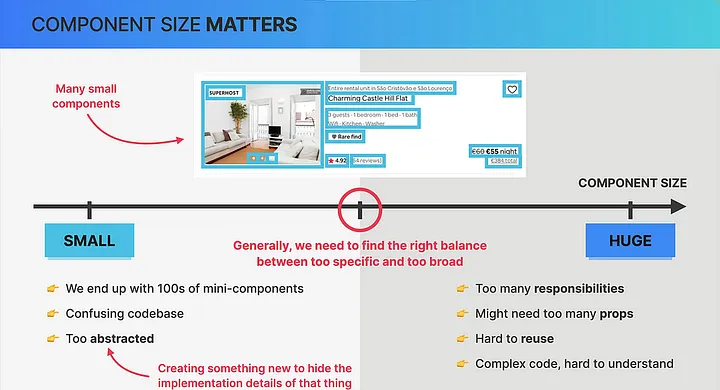
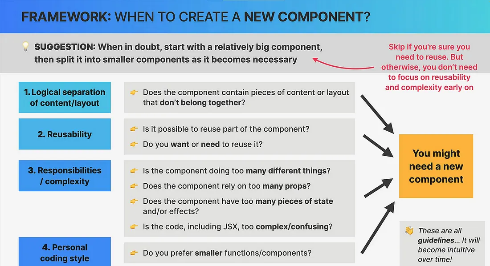
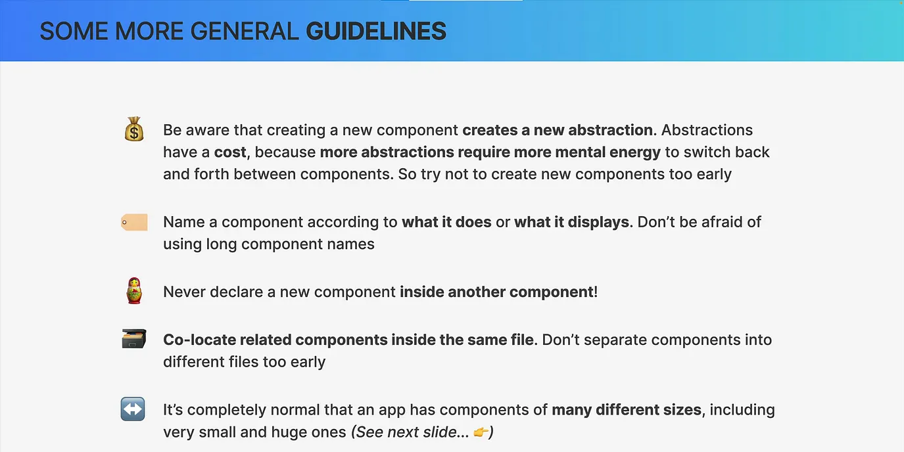
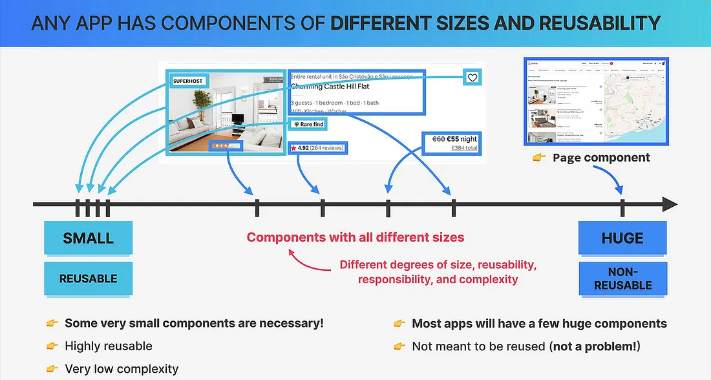

# Komponentenorientierte Frontend-Entwicklung

Eine strukturierte Vorgehensweise zur Entwicklung einzelner Frontend-Komponenten.

---

## Motivation

Wie war es vor Komponenten Frameworks?

---

Die zwei wichtigsten Skills als Frontend Dev:

- UI in Komponenten zerlegen
- State richtig verorten und managen

Sonst entstehen:

| Ohne Methode         | Mit Method                                          | Auswirkung                            | Design Pattern         |
| -------------------- | --------------------------------------------------- | ------------------------------------- | ---------------------- |
| Styling vor Struktur | Struktur vor Styling → verhindert zu frühes Styling | Klarere Priorisierung, weniger Rework | Separation of Concerns |

---

| Ohne Methode                                        | Mit Methode                       | Auswirkung                              | Design Pattern           |
| --------------------------------------------------- | --------------------------------- | --------------------------------------- | ------------------------ |
| Unklarer State / State-Chaos durch falsches Lifting | Klare State-Hierarchie            | Vorhersehbare Datenflüsse, weniger Bugs | Single Source of Truth   |
| Refactoring erst nach Feature-Fertigstellung        | Saubere Architektur von Anfang an | Weniger technische Schulden             | Clean Architecture       |
| Tests schwer zu schreiben                           | Testbare Komponenten by Design    | Höhere Testbarkeit, schnellere QA       | Testability by Design    |
| Lange Debug-Sessions                                | Klare Datenflüsse                 | Schnellere Fehleranalyse                | Unidirectional Data Flow |

---

| Ohne Methode                                      | Mit Method                             | Auswirkung                                   | Design Pattern                  |
| ------------------------------------------------- | -------------------------------------- | -------------------------------------------- | ------------------------------- |
| Vermischte Verantwortlichkeiten                   | Trennung von Verantwortlichkeiten      | Wiederverwendbarkeit, bessere Skalierbarkeit | Separation of Concerns          |
| Alle fangen an, aber nichts wird zu Ende gebracht | Schrittweise Entwicklung mit Fokus     | Höhere Abschlussrate, bessere Iteration      | Iterative Development           |
| Schwer wartbarer Code                             | Architektur by Design → Wartbarkeit    | Langfristig stabilere Codebasis              | Maintainability                 |
| Nicht wissen, wo anfangen                         | Komplexität reduzieren durch Zerlegung | Schnellere Entwicklungszeit                  | Divide and Conquer              |
| Chaotische Props                                  | Fest definierte Schnittstellen         | Klarere Kommunikation zwischen Komponenten   | Interface Segregation Principle |

---

## Komponentenraster

als erfahrener Entwickler schauen wir auf ein Frontend und können sofort Komponenten erkennen


---

## Wie brechen wir eine UI in Komponenten herunter?

- wir betrachten die Komponentengröße
- zu groß oder zu klein ist schlecht, wir braucehen den Sweet Spo


---

## Probleme mit zu große Komponenten


---

- Seperation of concerns: Wenn eine Komponente zu viele Aufgaben übernimmt, kann sie unübersichtlich und schwer handhabbar werden. Genau wie bei JavaScript-Funktionen gilt: Wenn eine Komponente zu viel leistet, sollte sie in kleinere Komponenten aufgeteilt werden.

- Wiederverwendbarkeit: Große Komponenten lassen sich oft nur schwer wiederverwenden, was den Nutzen modularer Komponenten untergräbt. Zudem können sie komplexen und verschachtelten Code enthalten, was ihre Wartung erschwert.

➡️ Möglicher Hinweis auf zu große Größe: Zu viele Props: Wenn eine Komponente eine große Anzahl von Props benötigt (z. B. 10 oder mehr), ist dies häufig ein Indiz dafür, dass die Komponente zu umfangreich ist und aufgeteilt werden muss.

---

## Probleme mit zu kleinen Komponenten



---

- Overhead: Zu viele kleine Komponenten können zu einem erhöhten Verwaltungsaufwand führen, da jede Komponente separat gepflegt und orchestriert werden muss. Dies kann die Komplexität erhöhen und die Entwicklung verlangsamen.
- Performance: Eine übermäßige Anzahl von Komponenten kann die Performance beeinträchtigen, da mehr Komponenten gerendert und aktualisiert werden müssen. Dies kann zu längeren Ladezeiten und schlechterer Benutzererfahrung führen.
- Unübersichtlichkeit: Wenn eine UI in zu viele kleine Komponenten zerlegt wird, kann dies die Übersichtlichkeit beeinträchtigen, da es schwieriger wird, den Gesamtzusammenhang zu verstehen und die Beziehungen zwischen den Komponenten zu erkennen.

---

## Die richtige Balance finden


1. Logische Trennungen: Komponenten sollten verschiedene Bereiche der Benutzeroberfläche (UI) klar voneinander abgrenzen – basierend auf Inhalt oder Layout. Jede Komponente sollte über eine klar definierte Zuständigkeit verfügen.
2. Wiederverwendbarkeit: Entwerfen Sie Komponenten so, dass sie in verschiedenen Bereichen der Anwendung wiederverwendbar sind. Wiederverwendbare Elemente wie Schaltflächen oder Labels fördern die Konsistenz und reduzieren Redundanzen.
3. Eindeutige Zuständigkeiten: Jede Komponente sollte einem einzigen Zweck dienen. Vermeiden Sie es, Komponenten durch die Übernahme mehrerer Aufgaben oder durch komplexen Code unnötig zu verkomplizieren.
4. Persönlicher Programmierstil: Ihre persönlichen Vorlieben sind entscheidend. Ganz gleich, ob Sie kleinere oder größere Komponenten bevorzugen: Strukturieren Sie Ihre Komponenten so, dass es zu Ihrem Arbeitsablauf passt – so bleiben Sie produktiv.

---

## 🛠️ Guideline zur Erstellung von Komponenten



---

1. Beginnen Sie mit einer größeren Komponente: Starten Sie mit einer größeren Komponente und unterteilen Sie diese bei Bedarf in kleinere Einheiten. Dieser inkrementelle Ansatz hilft dabei, die Komplexität zu bewältigen.
2. Nutzen Sie Kriterien für die Aufteilung:

- Logische Trennung: Teilen Sie Komponenten auf, wenn Teile der Komponente unzusammenhängend erscheinen.
- Wiederverwendbarkeit: Lagern Sie Teile, die an anderer Stelle nützlich sind, in neue Komponenten aus.
- Verantwortlichkeiten und Komplexität: Wenn eine Komponente zu komplex ist oder zu viele Verantwortlichkeiten trägt, ziehen Sie deren Aufteilung in Betracht.
- Persönlicher Programmierstil: Passen Sie die Größe der Komponenten an Ihre persönlichen Programmierpräferenzen an.

---



---

Richtlinien für die Komponentenerstellung

- Abstraktionskosten verstehen: Jede neue Komponente führt eine Abstraktion ein, die zusätzlichen kognitiven Mehraufwand verursacht. Vermeiden Sie es, neue Komponenten zu früh zu erstellen.
- Namenskonventionen: Benennen Sie Komponenten basierend auf ihrer Funktion oder ihrem Darstellungszweck. Lange, beschreibende Namen sind häufig erforderlich.
- Verschachtelte Komponentendeklarationen vermeiden: Deklarieren Sie keine neuen Komponenten innerhalb anderer Komponenten. Platzieren Sie stattdessen zusammengehörige Komponenten – sofern möglich – in derselben Datei.
- Vielfalt bei der Komponentengröße: Es ist völlig normal, dass Komponenten unterschiedliche Größen aufweisen. Kleine Komponenten sind wiederverwendbar und übersichtlich, während große Komponenten ganze Layouts oder komplexe Funktionalitäten abbilden können.

---



---

## State

🛑 Problem

- willkürliche Änderungen am DOM
- schwer vorauszusagen wie die UI auf Änderungen reagiert
- unübersichtlicher Code
- schwer zu debuggen
- schwer zu testen
- schwer zu warten
- schwer zu erweitern
- schwer zu verstehen
- schwer zu optimieren
- globale Namespace verschmutzung

✅ Lösung: State-Management

- State ist die einzige Quelle der Wahrheit
- UI ist eine Funktion des State
- State-Änderungen führen zu vorhersehbaren UI-Updates

---

##

💡 State machine patter

TODO

---

## Where Does State Live?

### Local State

Local state means in the Context of a Component

🚫 **Problem:** How do you implement state for something like user input?
✅ **Solution:** Use the SPA framework’s local state utility (e.g. React → `useState`)
⚠️ Anti-Pattern: Essential vs. derived state
⚠️ Best Practice: State immer möglichst nah am bgebracuhten Ort bereitstelle

---

⚠️ **Anti-Pattern:** Essential vs. derived state
Prefer derived state whenever possible instead of duplicating state.

```
Hochschul-Semesterplaner

┌──────────────────────────────────────────────┐
│ Hochschul-Semesterplaner                     │
│                                              │
│ Belegte Module:      [      5         ]      │ ← Essenzieller State
│ ECTS pro Modul:      [      6         ]      │ ← Essenzieller State
│ Semesterbeitrag:     [    150€        ]      │ ← Essenzieller State
│ BAföG / Förderung:   [    400€        ]      │ ← Essenzieller State
│                                              │
│ ------------------------------------------   │
│ Gesamt-ECTS:         [     30         ]      │ ← Abgeleiteter State
│ Restkosten:          [      0€        ]      │ ← Abgeleiteter State
│ Vollzeitstatus:      [   Vollzeit     ]      │ ← Abgeleiteter State
└──────────────────────────────────────────────┘
```

---

Essenzieller State (echte Eingaben)

```jsx
const [module, setModule] = useState(5);
const [ectsProModul, setEctsProModul] = useState(6);
const [semesterbeitrag, setSemesterbeitrag] = useState(150);
const [foerderung, setFoerderung] = useState(400);
```

Abgeleiteter State (berechnet)

```javascript
const gesamtECTS = module * ectsProModul;

const vollzeitstatus = gesamtECTS >= 30 ? "Vollzeit" : "Teilzeit";

const restkosten = semesterbeitrag - foerderung;
```

---

⚠️ **Best Practice:**

- Der Zustand sollte möglichst nah an seinem Ursprungsort gespeichert werden.
- In den meisten Fällen bedeutet das, ihn innerhalb der Komponente selbst zu speichern.

---

✅ Good Case: State lokal in der kleinsten sinnvollen Komponente

<div class="columns">

<div>

```jsx
function SearchInput() {
  const [query, setQuery] = React.useState("");

  return (
    <input
      value={query}
      onChange={(e) => setQuery(e.target.value)}
      placeholder="Suche..."
    />
  );
}

function App() {
  return (
    <div>
      <h1>Produkte</h1>
      <SearchInput />
    </div>
  );
}
```

</div>
<div>
Warum gut?

- `query` wird **nur dort gespeichert, wo es gebraucht wird**
- Weniger Prop Drilling
- `App` bleibt sauber und einfacher wartbar
- Änderungen triggern nur notwendige Re-Renders

</div>
</div>

---

❌ Bad Case: State unnötig weit oben (zu früh global)

<div class="columns">

<div>

```jsx
function App() {
  const [query, setQuery] = React.useState("");

  return (
    <div>
      <h1>Produkte</h1>
      <SearchInput query={query} setQuery={setQuery} />
    </div>
  );
}

function SearchInput({ query, setQuery }) {
  return (
    <input
      value={query}
      onChange={(e) => setQuery(e.target.value)}
      placeholder="Suche..."
    />
  );
}
```

</div>
<div>

Warum schlecht?

- `App` verwaltet State, obwohl es ihn nicht selbst nutzt
- Unnötige Props (`query`, `setQuery`)
- Mehr Komplexität bei wachsender Komponentenstruktur
- Höheres Risiko für unnötige Re-Renders

</div>
<div>

---

## 📌 Ausnahme

State darf höher liegen, wenn:

- Mehrere Geschwister-Komponenten darauf zugreifen
- Globales UI (Theme, Auth, Cart)
- Server State / Context sinnvoll ist

## Faustregel

**Lokaler State zuerst → Lift State Up nur bei echtem Bedarf**

---

## 🔼 Lifted State (Shared Parent State)

🚫 **Problem:** Zwei oder mehr Komponenten brauchen denselben State.
✅ **Lösung:** State zum **nächstgelegenen gemeinsamen Parent** verschieben.
⚠️ **Anti-Pattern:** State unnötig zu weit nach oben ziehen → Prop Drilling

---

✅ Good Case: State im nächsten gemeinsamen Parent

<div class="columns">

<div>

```jsx
function ProductPage() {
  const [query, setQuery] = React.useState("");

  return (
    <>
      <SearchInput query={query} setQuery={setQuery} />
      <ProductList query={query} />
    </>
  );
}

function SearchInput({ query, setQuery }) {
  return (
    <input
      value={query}
      onChange={(e) => setQuery(e.target.value)}
      placeholder="Suche Produkte..."
    />
  );
}

function ProductList({ query }) {
  const products = ["Laptop", "Maus", "Tastatur"];

  const filteredProducts = products.filter((product) =>
    product.toLowerCase().includes(query.toLowerCase()),
  );

  return (
    <ul>
      {filteredProducts.map((product) => (
        <li key={product}>{product}</li>
      ))}
    </ul>
  );
}
```

</div>
<div>
Warum gut?

- State lebt im **kleinsten gemeinsamen Parent**
- Beide Komponenten erhalten genau das, was sie brauchen
- Kein unnötiges Global State Management
- Klarer Datenfluss

</div>
<div>

---

❌ Bad Case: State zu hoch in `App`

<div class="columns">

<div>

```jsx
function App() {
  const [query, setQuery] = React.useState("");

  return (
    <Layout>
      <Header />
      <MainContent query={query} setQuery={setQuery} />
    </Layout>
  );
}

function MainContent({ query, setQuery }) {
  return <ProductPage query={query} setQuery={setQuery} />;
}

function ProductPage({ query, setQuery }) {
  return (
    <>
      <SearchInput query={query} setQuery={setQuery} />
      <ProductList query={query} />
    </>
  );
}
```

</div>
<div>

Warum schlecht?

- `App`, `Layout`, `MainContent` brauchen den State eigentlich nicht
- Props werden nur „durchgereicht“
- Mehr Boilerplate
- Schlechter wartbar
- Klassisches **Prop Drilling**
</div>
<div>

---

## 📌 Entscheidungsregel:

### Frage:

**„Was ist der kleinste gemeinsame Parent aller Komponenten, die diesen State brauchen?“**

### Antwort:

➡️ Genau dort gehört der State hin.

---

### Global State

🚫 **Problem:** How do you avoid prop drilling across many component layers?

✅ **Solution:** Use a global state mechanism such as React Context API (or similar solutions in other SPAs).

⚠️ **Problem:** Context can trigger broad top-down re-renders.
✅ **Optimization:** Use tools like Redux, Zustand, or selector-based state managers to re-render only the components that actually depend on changed state.

---

## State Hierarchie

### Lokal:

Nur eine Komponente → `useState`

### Lifted:

Mehrere nahe verwandte Komponenten → gemeinsamer Parent

### Global:

Viele entfernte Bereiche → Context / Zustand / Redux

---

## Wo wird State gespeichert?

### Im Arbeitsspeicher (Runtime State)

- Komponenten-State (`useState`, `useReducer`)
- Globale Stores (Redux, Zustand, Context)
- Existiert nur, solange die App läuft

```jsx
import { useState } from "react";

export default function Counter() {
  const [count, setCount] = useState(0);

  return <button onClick={() => setCount(count + 1)}>Klicks: {count}</button>;
}
```

---

### Local Storage / Session Storage

- Bleibt im Browser gespeichert
- Nützlich für Benutzereinstellungen, Auth-Tokens, Entwürfe
- `localStorage` bleibt über Sitzungen hinweg erhalten; `sessionStorage` wird gelöscht, wenn der Tab geschlossen wird

```jsx
import { useEffect, useState } from "react";

export default function ThemeToggle() {
  const [theme, setTheme] = useState(localStorage.getItem("theme") || "light");

  useEffect(() => {
    localStorage.setItem("theme", theme);
  }, [theme]);

  return (
    <button onClick={() => setTheme(theme === "light" ? "dark" : "light")}>
      Theme: {theme}
    </button>
  );
}
```

---

### Server

- Datenbanken, Benutzerprofile, Anwendungsdaten
- Über Geräte und Sitzungen hinweg verfügbar
- Wird oft über APIs abgerufen

```jsx
import { useEffect, useState } from "react";

export default function UserProfile() {
  const [user, setUser] = useState(null);

  useEffect(() => {
    fetch("/api/user")
      .then((res) => res.json())
      .then(setUser);
  }, []);

  if (!user) return <p>Lade...</p>;

  return <p>Hallo, {user.name}</p>;
}
```

---

### URL

- State wird in Query-Parametern, Pfad-Parametern oder Hash gespeichert
- Nützlich für Filter, Paginierung, Suchstatus, Deep Linking
- Teilbar und als Lesezeichen speicherbar

```jsx
import { useSearchParams } from "react-router-dom";

export default function ProductFilter() {
  const [searchParams, setSearchParams] = useSearchParams();
  const category = searchParams.get("category") || "all";

  return (
    <button onClick={() => setSearchParams({ category: "books" })}>
      Kategorie: {category}
    </button>
  );
}
```

---

## Zusammenfassung State

### State Management Patterns in React

TODO

https://link.excalidraw.com/readonly/t7BvLGu2IqLIWyzCgJIG

### State Architecture Example

TODO

### State anti-patterns

TODO

---

## Komponenten-Entwicklung

### Die 4 Schritte

```text
1. Component Structure
2. Data Flow
3. Functionality
4. Styling
```

Jede Komponente wird in genau dieser Reihenfolge entwickelt.

---

### Grundprinzip

```text
Skeleton
   ↓
Component API
   ↓
Behavior
   ↓
Appearance
```

Die Komponente wächst schrittweise.

---

# Beispiel-Komponente

## TodoItem

Wir entwickeln eine einzelne Komponente:

- Checkbox
- Todo-Text
- Delete-Button

---

# Schritt 1

# Component Structure

Zuerst nur die Grundstruktur.

Noch keine:

- Props
- Events
- Logik
- Styles

---

# React – Structure

```jsx
function TodoItem() {
  return (
    <div>
      <input type="checkbox" />
      <span>Todo Text</span>
      <button>Delete</button>
    </div>
  );
}
```

---

# Ziel von Structure

Fragen:

- Welche HTML-Elemente existieren?
- Welche Komponenten werden benötigt?
- Wie ist die Hierarchie?
- Welche Slots/Bereiche gibt es?

Die Komponente wird wie ein Wireframe aufgebaut.

---

# Schritt 2

# Data Flow

Jetzt definieren wir:

- Welche Daten kommen rein?
- Welche Events gehen raus?
- Wo liegt der State?

---

# React – Data Flow

```jsx
function TodoItem({ todo, onDelete, onToggle }) {
  return (
    <div>
      <input type="checkbox" checked={todo.done} />

      <span>{todo.text}</span>

      <button>Delete</button>
    </div>
  );
}
```

---

# Warum Data Flow wichtig ist

Viele Probleme entstehen durch:

- unklaren State
- doppelte Daten
- unklare Verantwortlichkeiten

Die Bare Bones Method löst zuerst die Architektur.

---

# Component API

Die Props definieren die API der Komponente.

```jsx
<TodoItem todo={todo} onDelete={handleDelete} onToggle={handleToggle} />
```

Dadurch wird die Komponente:

- wiederverwendbar
- testbar
- vorhersehbar

---

# Schritt 3

# Functionality

Erst jetzt wird Verhalten implementiert.

Zum Beispiel:

- Click Events
- API Calls
- Form Handling
- Validation
- State Updates

---

# React – Functionality

```jsx
function TodoItem({ todo, onDelete, onToggle }) {
  return (
    <div>
      <input
        type="checkbox"
        checked={todo.done}
        onChange={() => onToggle(todo.id)}
      />

      <span>{todo.text}</span>

      <button onClick={() => onDelete(todo.id)}>Delete</button>
    </div>
  );
}
```

---

# Vorteil dieser Reihenfolge

Die Funktionalität basiert jetzt auf:

- klarer Struktur
- sauberem Data Flow
- definierter Component API

Dadurch entstehen weniger Refactorings.

---

# Schritt 4

# Styling

Ganz am Ende:

- Layout
- Farben
- Animationen
- Responsiveness
- Design-Systeme

---

# React – Styling

```jsx
<div className="todo-item">
```

```css
.todo-item {
  display: flex;
  gap: 8px;
}
```

---

# Warum Styling zuletzt?

Zu frühes Styling führt oft zu:

- Ablenkung
- unnötigem Refactoring
- versteckten Architekturproblemen
- Fokusverlust

Die Methode priorisiert Funktion vor Design.

---

# Vue Beispiel

## Structure

```vue
<template>
  <div>
    <input type="checkbox" />
    <span></span>
    <button>Delete</button>
  </div>
</template>
```

---

# Vue Beispiel

## Data Flow

```vue
<script setup>
defineProps({
  todo: Object,
});

defineEmits(["delete", "toggle"]);
</script>
```

---

# Vue Beispiel

## Functionality

```vue
<input
  type="checkbox"
  :checked="todo.done"
  @change="$emit('toggle', todo.id)"
/>
```

---

# Typische Fehler ohne Bare Bones Method

- Sofort Styling beginnen
- Zu früh abstrahieren
- State unklar verteilen
- Komponenten zu groß machen
- Logik und UI vermischen

---

# Vorteile der Methode

## Technisch

- bessere Wartbarkeit
- sauberer Data Flow
- bessere Testbarkeit
- klarere Komponenten

## Im Team

- besseres Code Review
- einheitliche Struktur
- leichteres Onboarding

---

# Besonders geeignet für

- React
- Vue
- Svelte
- Component Libraries
- Design-Systeme
- moderne SPA-Entwicklung

---

# Fazit

Die Bare Bones Method ist:

- komponentenorientiert
- iterativ
- architekturfokussiert

Sie hilft dabei, Frontend-Komponenten:

- strukturiert
- verständlich
- wartbar
- skalierbar

zu entwickeln.

---

# Merksatz

```text
Structure first.
Data second.
Behavior third.
Design last.
```
