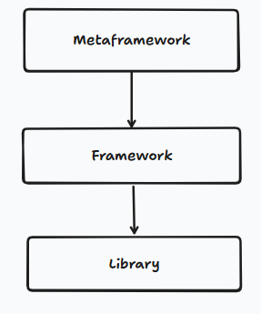
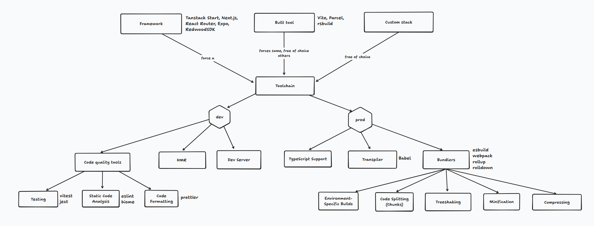
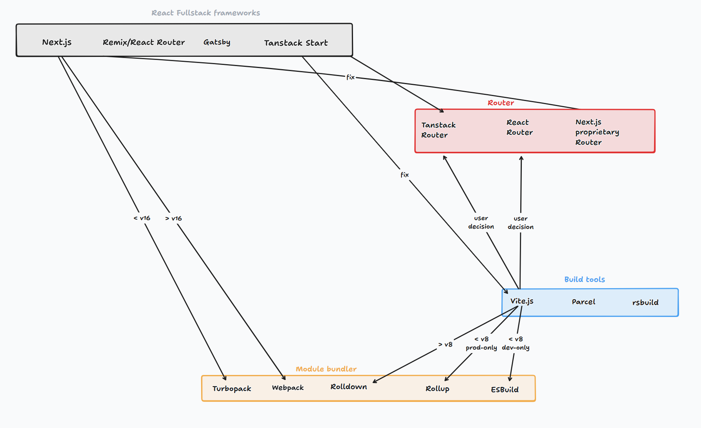

# Unraveling the tool terminology of JavaScript

## Library vs. Framework in the context of Single Page Applications (SPAs)

### Definition

> TL;DR:
> A library provides tools you call to perform tasks.
> A framework provides a structure that calls your code and guides how the application is built.  
> Library = flexible, unopinionated.  
> Framework = structured, opinionated.

First we need to understand the difference between a library and a framework. A library is a collection of pre-written code that developers can use to optimize tasks. It provides specific functionality that can be called upon when needed. A framework, on the other hand, is a more comprehensive structure that dictates the architecture of an application. It provides a foundation and guidelines for building applications, often including libraries within it.

### The spectrum

Instead of binary choices, we have a spectrum of JavaScript SPAs that range from unopinionated libraries to highly opinionated frameworks.

On one end, we have libraries like React, which provide specific functionality without dictating how you should structure your code.

On the other end, we have frameworks like Angular, which provide a complete structure and guidelines for building applications.

In between, we have hybrid approaches like Vue.js, which which describes itself as a progressive JavaScript Framework. It offers a balance between flexibility and structure which means that you can use it as a library or as a framework depending on your needs. Evan You (Vue's creator) has explicitly described it as a "progressive framework" — meaning you can adopt it incrementally like a library, or use it as a full framework. That's a deliberate positioning, not a cop-out.

The case for library:

- You can drop a ``<script>`` tag into an existing HTML page and use Vue for just one component
- No CLI required, no build step required
- You bring your own router (Vue Router is separate), your own state management (Pinia is separate)

The case for framework:

- The official ecosystem (Vue Router, Pinia, Vite integration, CLI) is so tightly maintained by the core team that it feels like a framework in practice
- It has strong opinions on component structure, reactivity model, and single-file components
- Most people use it as a full framework, not as a sprinkled library

## What is a meta-framework?

A meta-framework is a framework that is built on top of another framework. It provides additional features and functionality while still leveraging the underlying framework. Given this definition, we can not say that Next.js is a meta-framework, because it is built on top of React, which is a library. We can say that Next.js is a React framework.

On the other hand, we can say that Analog is a meta-framework, because it is built on top of Angular, which is a JavaScript framework.

## What is a build tool?

A build tool has solves the following problems:

- Transpilation: Converting modern JavaScript (ES6+) into a version that is compatible with older browsers.
- Bundling: Combining multiple JavaScript files into a single file to reduce the number of HTTP requests.
- Tree shaking: Removing unused code from the final bundle to reduce file size and improve performance.
- Compression: Minifying and compressing the code to further reduce file size and improve load times.
- Minification: Removing unnecessary characters from the code to reduce file size and improve load times.
- Code splitting: Automatically splitting code into smaller chunks that can be loaded on demand, improving performance.
- Asset management: Handling static assets like images, fonts, and stylesheets, optimizing them for production.
- Configuration: Allowing developers to customize the build process through configuration files or plugins.

## Difference between a framework, a build tool, and  tool chain

As we learned, a framework is opinionated and therefore it forces as to use a certain toolchain. This said we need to understand what a tool chain is. A tool chain consists of tools we use during development for example code quality tools and Built tools (see the diagram). 

On the other end of the spectrum, we have the custom stack, where we have complete freedom to choose our tools. that said we again have a spectrum rather than a binary choice. The hybrid approach would be to use a built tool like Vite. It gives us the flexibility to work with various SPA frameworks or even without a SPA framework, while still providing specific functionality for optimizing the build process. For concrete example, in Next.js we are forced to use React as SPA framework and the proprietary router as router. In contrast, if we use Vite as our build tool, we can choose to use React, Vue, Angular, or even no SPA framework at all and React Router or TanStack Router as a router. This gives us more flexibility in how we build our application while still benefiting from some time savings and optimizations provided by the build tool concerning setting up the build process and optimizing the output for example.

 In the following diagram I tried to modulate what tool can be combined with what other tool. For example, we can use Vite as a build tool with React as a SPA framework and React Router as a router. We can also use Vite with Vue and Vue Router or Angular and Angular Router. On the other hand, we cannot use Next.js with Vue or Angular because Next.js is built on top of React and is not compatible with other SPA frameworks. This is not complete but it gives us an idea of how the different tools can be combined together.

