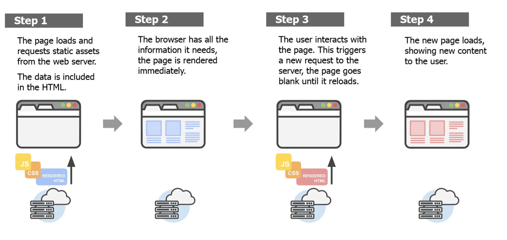

# Entwicklung der Web-Architektur

## Von statischen Seiten zu MPAs über SPAs

---

# Inhaltsverzeichnis

1. [Statische Seiten](#1-statische-seiten)
2. [MPA (Multi Page Application)](#2-mpa-multi-page-application)
3. [SPA (Single Page Application)](#3-spa-single-page-application)
4. [Fazit](#4-fazit)

---

# 1. Statische Seiten

---

<!-- header: "Statische Seiten" -->

## 1.1 Kurzüberblick

- Fest kodierte HTML-, CSS- und optional JavaScript-Dateien — Inhalte ändern sich nicht dynamisch.

## 1.2 Eigenschaften

- **Einfachheit:** Kein Backend erforderlich
- **Schnelligkeit:** Direkte Auslieferung vom Server
- **Sicherheit:** Keine serverseitige Logik → weniger Angriffspunkte

## 1.3 Technologien & Einsatz

- **Technologien:** HTML · CSS · JavaScript
- **Einsatzgebiete:** Portfolio, Dokumentation, Landing Pages

---

## 1.4 Herausforderungen

- so hat das Internet angefangen
- ganz am Anfang sogar noch ohne JavaScript (Form submit ohne JavaScript)

ABER:

🛑 Problem

- keine aktuellen Daten: z. B. bei einer Nachrichtenseite, einem Online-Shop oder einem sozialen Netzwerk sind aktuelle (tagesaktuelle bis sekundenaktuelle) Inhalte essenziell
- keine Datenkomplexität abbildbar: große Datenmengen sind nicht wartbar

✅ Lösung: MPAs (Multi Page Applications)

---

<!-- header: "" -->

# 2. MPA (Multi Page Application)

---

<!-- header: "MPA (Multi Page Application)" -->

- Jede Seite ist eine eigene HTML-Datei und wird mit Daten aus der Datenbank angereichert
- Navigation führt zu vollständigen Seiten-Neuladungen
  

---

## 2.1 Technologien für MPAs

| Programmiersprache | MPA-Framework                     |
| ------------------ | --------------------------------- |
| C#                 | ASP.NET Core (früher ASP.NET MVC) |
| Ruby               | Ruby on Rails                     |
| PHP                | Laravel                           |
| Python             | Django                            |
| Java               | Spring MVC                        |

---

## 2.2 Herausforderungen von MPAs

🛑 Problem:

- keine gute Nutzererfahrung, da immer die gesamte Seite neu geladen wird
  - langsam
  - Nutzer sind eine andere UX (User Experience = Nutzererfahrung) aus mobilen Apps gewöhnt (wenn ich ein Bild auf Instagram like, wird nicht die ganze Seite neu geladen, sondern nur das Bild bekommt ein rotes Herz)

✅ Lösung: AJAX (Asynchronous JavaScript and XML)

---

## 2.3 AJAX

- AJAX (Asynchronous JavaScript and XML) ermöglicht es, Daten im Hintergrund zu laden und die Seite dynamisch zu aktualisieren, ohne sie vollständig neu zu laden
- Konkret: Daten von einem Webserver lesen oder an ihn senden – **ohne die Seite neu zu laden**
- AJAX ist eine irreführende Bezeichnung, da es nicht auf XML beschränkt ist, sondern auch JSON oder andere Formate verwenden kann
- AJAX ist eher ein Konzept (Design Pattern) als eine konkrete Technologie; es umfasst verschiedene APIs wie `XMLHttpRequest` oder die modernere `fetch` API
- Verschiedene Browser-Inkonsistenzen wurden damals durch **jQuery** vereinfacht

---

## 2.4 Herausforderungen von AJAX / Vanilla JS

🛑 Probleme:

- Schwer wiederverwendbarer Code
- Unkontrollierte Seiteneffekte
- Spaghetti-Code durch unkontrollierte DOM-Manipulation
- Viele Bugs und unvorhersehbares Verhalten
- Schlechte Developer Experience
- Fast keine automatisierten Tests möglich

---

✅ Lösung: SPAs (Single Page Applications) mit modernen Frameworks

- **OOP** – Komponenten als zentrale Abstraktion (Kapselung, Wiederverwendbarkeit) ➡️ [3.2 Architekturvorbild aus dem Backend: OOP im Frontend](#32-architekturvorbild-aus-dem-backend-oop-im-frontend)
- **Deklarative Programmierung** – UI als Funktion des States beschreiben (in React: JSX) ➡️ [3.3 Von imperativ zu deklarativ](#33-von-imperativ-zu-deklarativ)
- **State-Machine-Pattern** – deterministische Modellierung und Verwaltung von Anwendungsdaten ➡️ Vorlesung Frontend Advanced

---

<!-- header: "" -->

# 3. SPA (Single Page Application)

- Komplette Webseite wird bei der initialen Anfrage geladen
- Inhalte werden dynamisch über **JavaScript** und **APIs** aktualisiert

---

## 3.1 Technologien für SPAs

- JavaScript-basiert:
  - React
  - Angular
  - Vue.js
  - Svelte

- Ausnahme:
  - Blazor (C#) (nutzt u.a. **WebAssembly**)

---

## 3.2 Architekturvorbild aus dem Backend: OOP im Frontend

Das Backend kannte Klassen, Kapselung und Wiederverwendbarkeit schon lange – diese Ideen werden nun auf das Frontend übertragen:

| OOP-Konzept      | Frontend-Entsprechung                              |
| ---------------- | -------------------------------------------------- |
| Klasse           | Komponente (z. B. `<Button />`, `<MovieCard />`)   |
| Kapselung        | Komponente verwaltet eigenen State und eigenes CSS |
| Wiederverwendung | Komponente wird an mehreren Stellen eingesetzt     |
| Komposition      | Komponenten werden ineinander verschachtelt        |

> Eine Komponente ist eine in sich geschlossene Einheit aus **Struktur (JSX)**, **Logik (JS)** und optional **Stil (CSS)**.

---

## TODO: SOLID Prinzipien

## 3.3 Von imperativ zu deklarativ

### 3.3.1 Plain JavaScript (Vanilla JS)

```html
<div id="banner-message" style="display:none;">Hello!</div>

<div id="button-container">
  <button>Show Message</button>
</div>

<script>
  const hiddenBox = document.getElementById("banner-message");
  const button = document.querySelector("#button-container button");

  button.addEventListener("click", function () {
    hiddenBox.style.display = "block";
  });
</script>
```

---

**Kerngedanken**

- Viel Code für eine einfache Aufgabe
- Direkte DOM-Manipulation mit `style.display`

---

### 3.3.2 jQuery

```javascript
var hiddenBox = $("#banner-message");

$("#button-container button").on("click", function (event) {
  hiddenBox.show();
});
```

**Warum jQuery so populär wurde**

Damals:

- Browser-APIs waren inkonsistent
- Event-Handling unterschied sich je nach Browser
- DOM-Manipulation war sehr ausführlich

jQuery machte vieles kürzer und verlässlicher.

---

### 3.3.3 React

React verändert die Denkweise komplett. Statt DOM-Elemente manuell ein- oder auszublenden, aktualisieren Sie den **State** und React aktualisiert die UI.

```jsx
import { useState } from "react";

export default function App() {
  const [isVisible, setIsVisible] = useState(false);

  return (
    <div>
      {isVisible && <div id="banner-message">Hello!</div>}

      <div id="button-container">
        <button onClick={() => setIsVisible(true)}>Show Message</button>
      </div>
    </div>
  );
}
```

**Zentrale React-Ideen**

- Keine direkte DOM-Manipulation
- Die UI wird durch State gesteuert
- Bedingtes Rendering:

  ```jsx
  {
    isVisible && <div>Hello!</div>;
  }
  ```

- Event-Handling ist in JSX integriert:

  ```jsx
  onClick={...}
  ```

---

### 3.3.4 Fazit

#### 3.3.4.1 Zusammenfassung der Entwicklung

| Epoche   | Stil                  | Grundidee                |
| -------- | --------------------- | ------------------------ |
| Plain JS | Imperativ             | DOM manuell verändern    |
| jQuery   | Vereinfacht imperativ | DOM leichter verändern   |
| React    | Deklarativ            | UI aus State beschreiben |

---

#### 3.3.4.2 Der große Wandel

**Plain JS / jQuery**

Sie sagen dem Browser:

> "Finde dieses Element und ändere es."

```js
hiddenBox.show();
```

**React**

Sie sagen React:

> "Wenn der State sichtbar ist, rendere das Element."

```jsx
{
  isVisible && <Banner />;
}
```

Dieses deklarative Modell ist der zentrale Entwicklungsschritt von jQuery zu React.

---

<!-- header: "Fazit " -->

# 4. Fazit

---

<!-- header: "Fazit " -->

## 4.1 Fazit

- Jede Architektur hat ihre Stärken und Schwächen.
- Die Wahl hängt von den Anforderungen des Projekts ab (z. B. Performance, Interaktivität, SEO).
- MPAs sind immer noch weit verbreitet, insbesondere für content-lastige Websites, während SPAs für komplexe, interaktive Anwendungen bevorzugt werden.
- Die Entwicklung von Web-Architekturen ist ein kontinuierlicher Prozess, der sich mit den Bedürfnissen der Nutzer und den technologischen Fortschritten weiterentwickelt.
- Die Zukunft liegt in hybriden Ansätzen, die die Vorteile von Static Pages, MPAs und SPAs kombinieren (z. B. durch serverseitiges Rendering oder statische Generierung mit dynamischen Komponenten) (siehe Advanced Concepts SPA Vorlesung).

---

## 4.2 Vergleich: Statisch vs. MPA vs. SPA

| Kriterium              | Statisch                                                | MPA                                                           | SPA                                              |
| ---------------------- | ------------------------------------------------------- | ------------------------------------------------------------- | ------------------------------------------------ |
| **Definition**         | Websites mit festen HTML-Seiten ohne dynamische Inhalte | Mehrere Seiten, jede lädt separat                             | Eine Seite, Inhalte dynamisch nachgeladen        |
| **Performance**        | Sehr schnell (keine Server-Interaktionen notwendig)     | Langsamer (jede Navigation führt zu einem neuen Seitenaufruf) | Sehr schnell nach initialem Laden                |
| **Ladezeit (initial)** | Minimal (nur statische Ressourcen)                      | Abhängig von der Seitengröße und Server-Antwortzeit           | Höher (komplette Anwendung wird initial geladen) |

---

| Kriterium             | Statisch                                        | MPA                                                                             | SPA                                                        |
| --------------------- | ----------------------------------------------- | ------------------------------------------------------------------------------- | ---------------------------------------------------------- |
| **Interaktivität**    | Minimal (kaum bis keine dynamischen Funktionen) | Gut (kann interaktive Elemente enthalten)                                       | Sehr hoch (hohe Interaktivität und dynamisches UI möglich) |
| **Datenintegration** | Kaum oder keine (statisch eingebettete Inhalte) | Umfangreich (direkte Backend-Integration möglich)                               | Umfangreich (APIs werden für dynamische Daten verwendet)   |
| **Technologien**      | HTML, CSS, ggf. JavaScript                      | HTML, CSS, JavaScript, Backend-Sprachen (z.B. PHP, Ruby on Rails, ASP.NET Core) | JavaScript-Frameworks (z.B. React, Angular, Vue)           |

---

| Kriterium               | Statisch                                     | MPA                                             | SPA                                                       |
| ----------------------- | -------------------------------------------- | ----------------------------------------------- | --------------------------------------------------------- |
| **Nutzererfahrung**     | Gering (wenig dynamische Interaktion)         | Gut (klassisches Website-Erlebnis)             | Sehr gut (App-ähnliche Erfahrung)                          |
| **Caching**             | Einfach (CDN-Caching funktioniert perfekt)   | Möglich (pro Seite separat)                     | Schwieriger (State-Management und dynamische Daten)       |
| **SEO-Freundlichkeit**  | Sehr gut (vollständig durchsuchbare Inhalte) | Gut (jedes HTML-Dokument ist separat indiziert) | Mäßig (serverseitiges Rendering oder Prerendering nötig)  |
| **Beispiele**           | Portfolio-Websites, Blogs, Dokumentationen   | Online-Shops, Foren, Nachrichtenseiten          | Gmail, Trello, Google Maps                                |
