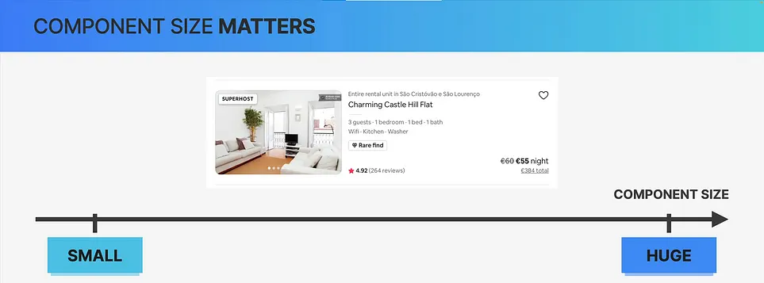
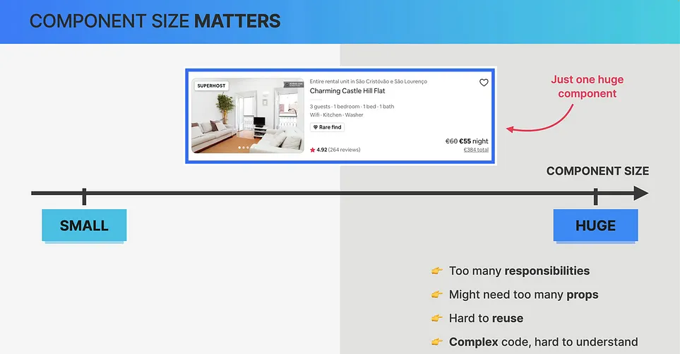
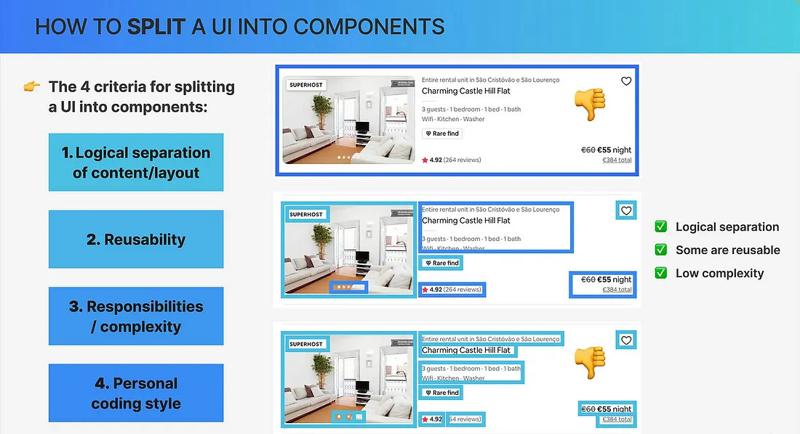
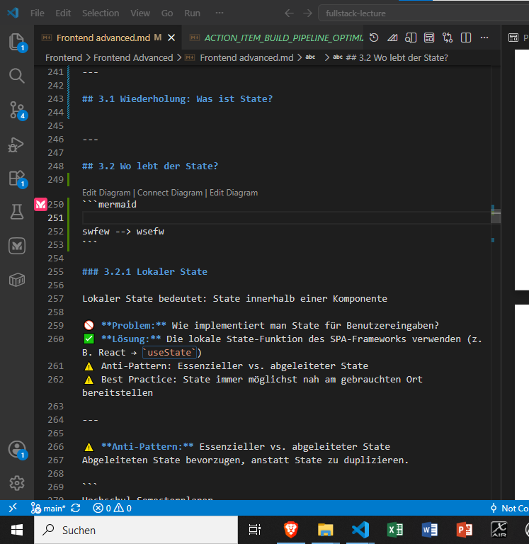
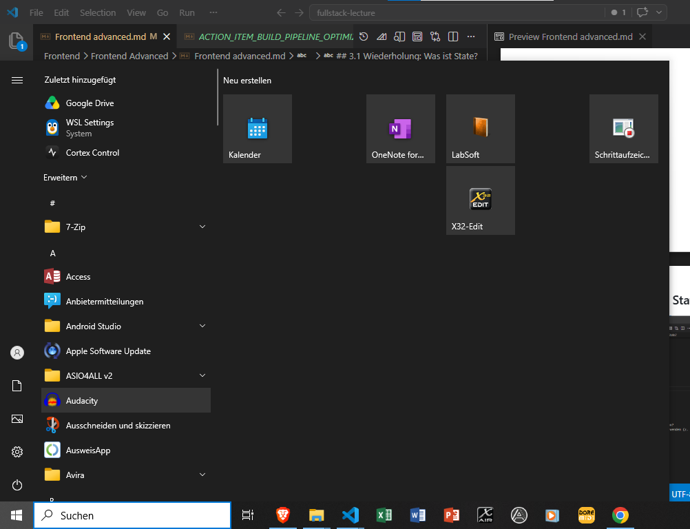
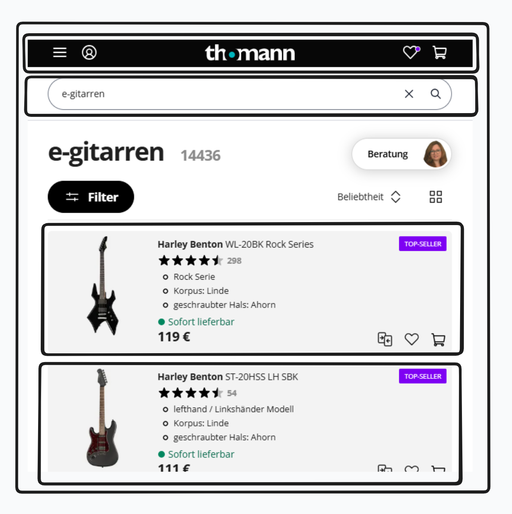
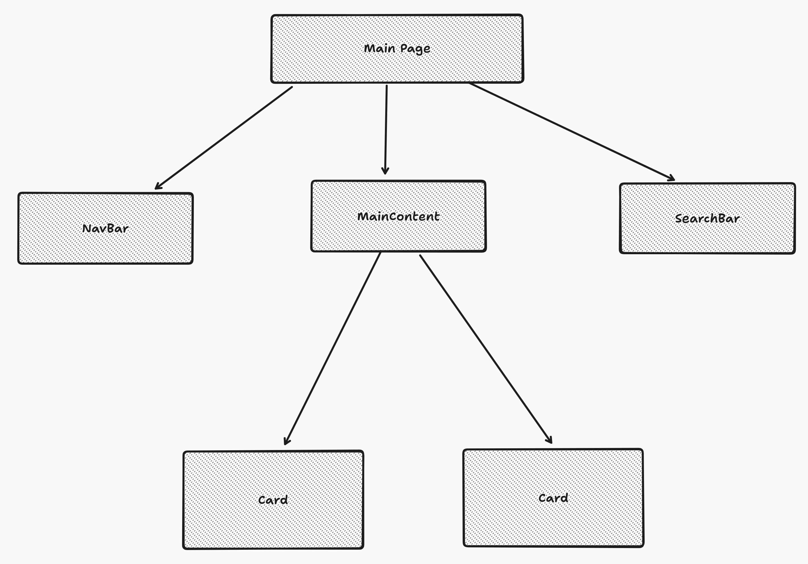
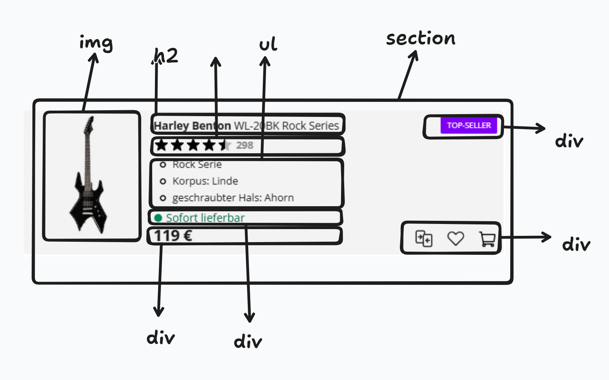

# Komponentenorientierte Frontend-Entwicklung

Eine strukturierte Vorgehensweise zur Entwicklung moderner UIs

---

# Inhaltsverzeichnis

1. Motivation
2. Komponenten
   - 2.1 Komponentenraster
   - 2.2 Wie brechen wir eine UI in Komponenten herunter?
   - 2.3 Probleme mit zu großen Komponenten
   - 2.4 Probleme mit zu kleinen Komponenten
   - 2.5 Die richtige Balance finden
   - 2.6 🛠️ Guideline zur Erstellung von Komponenten
   - 2.7 Richtlinien für die Komponentenerstellung
   - 2.8 🧰 Aufgabe

---

3. State
   - 3.1 State machine pattern
   - 3.2 Wo lebt der State?
     - 3.2.1 Lokaler State
     - 3.2.2 🔼 Lifted State (Shared Parent State)
     - 3.2.3 Global State
     - 3.2.4 Zusammenfassung State Hierarchie
   - 3.3 Wo wird State gespeichert?
     - 3.3.1 Im Arbeitsspeicher (Runtime State)
     - 3.3.2 Local Storage / Session Storage
     - 3.3.3 Server
     - 3.3.4 URL

---

4. Der Senior Workflow für moderne Frontend-Komponentenentwicklung
   - 4.1 Die 5 Schritte
   - 4.2 Schritt 1: Komponentenstruktur und Hierarchie festlegen
   - 4.3 Schritt 2: HTML Struktur
   - 4.4 Schritt 3: Datenfluss
   - 4.5 Schritt 4: Functionality
   - 4.6 Schritt 5: Styling

---

# 1. Motivation

➡️ siehe Vorlesung Entwicklung der Web-Architektur

---

Die zwei wichtigsten Skills als Frontend Dev:

- UI in Komponenten zerlegen
- State richtig verorten und managen

-> Damit bauen erreichen wir eine zukunftsfähige Architektur

Sonst entstehen:

- Schwer zu testen -> Wenn es keine Tests gibt, testet der Kunde -> das ist schlecht
- Schwer zu erweitern -> aufgrund einer schelchten Architekrur skaliert die Anwendung nicht -> eigentlich einfache Features dauern lange zu implementieren
- Schwer zu warten -> Änderungen an bestehenden Code schwierig, wie zum Beispiel Bug-Suche oder Migration -> resultiert aus fehlendenmVerständnis und schwer zu debuggender Anwendung

---

# 2. Komponentenraster

---

## 2.1 Motivation

<div class=" columnstwothird ">
<div>


</div>
<div>
Als erfahrener Entwickler schauen wir auf ein Frontend und können sofort Komponenten erkennen

</div>
</div>

---

## 2.2 Wie brechen wir eine UI in Komponenten herunter?

- wir betrachten die Komponentengröße
- zu groß oder zu klein ist schlecht, wir brauchen den Sweet Spot



---

## 2.3 Probleme mit zu großen Komponenten



---

- Separation of concerns: Wenn eine Komponente zu viele Aufgaben übernimmt, kann sie unübersichtlich und schwer handhabbar werden. Genau wie bei JavaScript-Funktionen gilt: Wenn eine Komponente zu viel leistet, sollte sie in kleinere Komponenten aufgeteilt werden.

- Wiederverwendbarkeit: Große Komponenten lassen sich oft nur schwer wiederverwenden, was den Nutzen modularer Komponenten untergräbt. Zudem können sie komplexen und verschachtelten Code enthalten, was ihre Wartung erschwert.

➡️ Möglicher Hinweis auf zu große Größe: Zu viele Props: Wenn eine Komponente eine große Anzahl von Props benötigt (z. B. 10 oder mehr), ist dies häufig ein Indiz dafür, dass die Komponente zu umfangreich ist und aufgeteilt werden muss.

---

## 2.4 Probleme mit zu kleinen Komponenten


---

- Overhead: Zu viele kleine Komponenten können zu einem erhöhten Verwaltungsaufwand führen, da jede Komponente separat gepflegt und orchestriert werden muss. Dies kann die Komplexität erhöhen und die Entwicklung verlangsamen.
- Performance: Eine übermäßige Anzahl von Komponenten kann die Performance beeinträchtigen, da mehr Komponenten gerendert und aktualisiert werden müssen. Dies kann zu längeren Ladezeiten und schlechterer Benutzererfahrung führen.
- Unübersichtlichkeit: Wenn eine UI in zu viele kleine Komponenten zerlegt wird, kann dies die Übersichtlichkeit beeinträchtigen, da es schwieriger wird, den Gesamtzusammenhang zu verstehen und die Beziehungen zwischen den Komponenten zu erkennen.

---

## 2.5 Die richtige Balance finden



1. Logische Trennungen: Komponenten sollten verschiedene Bereiche der Benutzeroberfläche (UI) klar voneinander abgrenzen – basierend auf Inhalt oder Layout. Jede Komponente sollte über eine klar definierte Zuständigkeit verfügen.
2. Wiederverwendbarkeit: Entwerfen Sie Komponenten so, dass sie in verschiedenen Bereichen der Anwendung wiederverwendbar sind. Wiederverwendbare Elemente wie Schaltflächen oder Labels fördern die Konsistenz und reduzieren Redundanzen.
3. Eindeutige Zuständigkeiten: Jede Komponente sollte einem einzigen Zweck dienen. Vermeiden Sie es, Komponenten durch die Übernahme mehrerer Aufgaben oder durch komplexen Code unnötig zu verkomplizieren.
4. Persönlicher Programmierstil: Ihre persönlichen Vorlieben sind entscheidend. Ganz gleich, ob Sie kleinere oder größere Komponenten bevorzugen: Strukturieren Sie Ihre Komponenten so, dass es zu Ihrem Arbeitsablauf passt – so bleiben Sie produktiv.

---

## 2.6 🛠️ Guideline zur Erstellung von Komponenten


---

1. Beginnen Sie mit einer größeren Komponente: Starten Sie mit einer größeren Komponente und unterteilen Sie diese bei Bedarf in kleinere Einheiten. Dieser inkrementelle Ansatz hilft dabei, die Komplexität zu bewältigen.
2. Nutzen Sie Kriterien für die Aufteilung:

- Logische Trennung: Teilen Sie Komponenten auf, wenn Teile der Komponente unzusammenhängend erscheinen.
- Wiederverwendbarkeit: Lagern Sie Teile, die an anderer Stelle nützlich sind, in neue Komponenten aus.
- Verantwortlichkeiten und Komplexität: Wenn eine Komponente zu komplex ist oder zu viele Verantwortlichkeiten trägt, ziehen Sie deren Aufteilung in Betracht.
- Persönlicher Programmierstil: Passen Sie die Größe der Komponenten an Ihre persönlichen Programmierpräferenzen an.

---

## 2.7 Richtlinien für die Komponentenerstellung

- Abstraktionskosten verstehen: Jede neue Komponente führt eine Abstraktion ein, die zusätzlichen kognitiven Mehraufwand verursacht. Vermeiden Sie es, neue Komponenten zu früh zu erstellen.
- Namenskonventionen: Benennen Sie Komponenten basierend auf ihrer Funktion oder ihrem Darstellungszweck. Lange, beschreibende Namen sind häufig erforderlich.
- Verschachtelte Komponentendeklarationen vermeiden: Deklarieren Sie keine neuen Komponenten innerhalb anderer Komponenten. Platzieren Sie stattdessen zusammengehörige Komponenten – sofern möglich – in derselben Datei.
- Vielfalt bei der Komponentengröße: Es ist völlig normal, dass Komponenten unterschiedliche Größen aufweisen. Kleine Komponenten sind wiederverwendbar und übersichtlich, während große Komponenten ganze Layouts oder komplexe Funktionalitäten abbilden können.

---


---

## 2.8 🧰 Aufgabe

- Gehen Sie auf eine Webseite Ihrer Wahl
- Machen Sie einen Screenshot
- Zeichnen Sie die Komponenten ein
- z.B. eine Anzeige auf https://www.kleinanzeigen.de/

---

# 3. State

---

## 3.1 Wiederholung: Was ist State?

State = Zustand

<div class="columns">

<div>



</div>



</div>

---

## 3.2 für was brauchen wir State?

<div class="columns">
<div>
🛑 Problem

- willkürliche Änderungen am DOM
- schwer vorauszusagen wie die UI auf Änderungen reagiert
- unübersichtlicher Code
- schwer zu debuggen
- schwer zu testen
- schwer zu warten
- schwer zu erweitern
- schwer zu verstehen
- schwer zu optimieren
- globale Namespace-Verschmutzung
</div>

<div>
✅ Lösung: State-Management

- State ist die einzige Quelle der Wahrheit
- UI ist eine Funktion des State
- State-Änderungen führen zu vorhersehbaren UI-Updates
</div> 
</div>

---

## Szenario: To-Do-Liste mit Fortschrittsbalken

Ein Klick auf eine Checkbox muss **4 Dinge gleichzeitig** aktualisieren:

- Text durchstreichen
- Fortschrittsbalken
- Zähler ("3/5 erledigt")
- "Alles geschafft!"-Banner

---

### Vorher: Plain JavaScript

Sie sind der **Kurier**, der zu Fuß jede einzelne Stelle im Haus anläuft.

```js
// EIN Klick → 4 manuelle Lieferungen
checkbox.addEventListener("click", () => {
  todo[2].done = true; // 1. Daten ändern

  document.getElementById("text-2").classList.add("done"); // 2. Text
  document.getElementById("bar").style.width = "60%"; // 3. Balken
  document.getElementById("count").textContent = "3/5"; // 4. Zähler
});
```

**Das Problem:**  
Eine Änderung = 5 Zeilen, 5 separate DOM-Anfassungen.  
Vergisst du den Balken, lügt die App.  
Löscht du ein Todo, brauchst du **noch mehr** manuelle Updates.

---

### Nachher: React mit State

Sie sind der **Architekt**, der den Plan ändert. Der Bauroboter (React) baut alles automatisch neu.

```tsx
const [todos, setTodos] = useState([...])

// EIN Klick → EINE Datenänderung. Fertig.
const toggle = (id) => setTodos(todos.map(t =>
  t.id === id ? { ...t, done: !t.done } : t
))

// Alles andere ergibt sich automatisch:
return (
  <>
    {todos.map(t => (
      <p className={t.done ? 'done' : ''}>{t.text}</p>  // Text
    ))}
    <div style={{ width: `${percent}%` }} />             // Balken
    <p>{doneCount}/{total}</p>                           // Zähler
  </>
)
```

---

## Der Unterschied auf einen Blick

|                         | Plain JS                       | React State                           |
| ----------------------- | ------------------------------ | ------------------------------------- |
| **Deine Aufgabe**       | Jede Lampe einzeln umschalten  | Nur den Schalter betätigen            |
| **Quelle der Wahrheit** | DOM + Variable (2 Wahrheiten)  | State (1 Wahrheit)                    |
| **Fehler**              | Vergessene Zeile = kaputte UI  | Unmöglich, eine Stelle zu "vergessen" |
| **Erweiterung**         | Neue Anzeige = neuer DOM-Query | Neue Anzeige = neues `{state}`        |

---

## Fazit

> **State ist ein Spiegel.**  
> In Plain JS hältst du den Spiegel selbst in der Hand und musst bei jeder Bewegung alle Bilder einzeln anpassen.  
> Mit State stellst du dich nur hin – der Spiegel zeigt automatisch das richtige Bild.

<!-- ## 3.1 State machine pattern

TODO -->

---

## 3.2 Wo lebt der State?

### 3.2.1 Lokaler State

Lokaler State bedeutet: State innerhalb einer Komponente

🚫 **Problem:** Wie implementiert man State für Benutzereingaben?
✅ **Lösung:** Die lokale State-Funktion des SPA-Frameworks verwenden (z. B. React → `useState`)
⚠️ Anti-Pattern: Essenzieller vs. abgeleiteter State
⚠️ Best Practice: State immer möglichst nah am gebrauchten Ort bereitstellen

---

⚠️ **Anti-Pattern:** Essenzieller vs. abgeleiteter State
Abgeleiteten State bevorzugen, anstatt State zu duplizieren.

```

Hochschul-Semesterplaner

┌─────────────────────────────┐
│ Hochschul-Semesterplaner    │
│                             │
│ Belegte Module: [ 5 ]       │ ← Essenzieller State
│ ECTS pro Modul: [ 6 ]       │ ← Essenzieller State
│ Semesterbeitrag: [ 150€ ]   │ ← Essenzieller State
│ BAföG / Förderung: [ 400€ ] │ ← Essenzieller State
│                             │
│ --------------------------- │
│ Gesamt-ECTS: [ 30 ]         │ ← Abgeleiteter State
│ Restkosten: [ 0€ ]          │ ← Abgeleiteter State
│ Vollzeitstatus: [ Vollzeit ]│ ← Abgeleiteter State
└─────────────────────────────┘

```

---

Essenzieller State (echte Eingaben)

```jsx
const [module, setModule] = useState(5);
const [ectsProModul, setEctsProModul] = useState(6);
const [semesterbeitrag, setSemesterbeitrag] = useState(150);
const [foerderung, setFoerderung] = useState(400);
```

Abgeleiteter State (berechnet)

```javascript
const gesamtECTS = module * ectsProModul;

const vollzeitstatus = gesamtECTS >= 30 ? "Vollzeit" : "Teilzeit";

const restkosten = semesterbeitrag - foerderung;
```

---

## Aufgabe: essential vs derived State

siehe PDF

---

⚠️ **Best Practice:**

- Der Zustand sollte möglichst nah an seinem Ursprungsort gespeichert werden.
- In den meisten Fällen bedeutet das, ihn innerhalb der Komponente selbst zu speichern.

---

✅ Good Case: State lokal in der kleinsten sinnvollen Komponente

<div class="columns">

<div>

```jsx
function SearchInput() {
  const [query, setQuery] = React.useState("");

  return (
    <input
      value={query}
      onChange={(e) => setQuery(e.target.value)}
      placeholder="Suche..."
    />
  );
}

function App() {
  return (
    <div>
      <h1>Produkte</h1>
      <SearchInput />
    </div>
  );
}
```

</div>
<div>
Warum gut?

- `query` wird **nur dort gespeichert, wo es gebraucht wird**
- Weniger Prop Drilling
- `App` bleibt sauber und einfacher wartbar
- Änderungen triggern nur notwendige Re-Renders

</div>
</div>

---

❌ Bad Case: State unnötig weit oben (zu früh global)

<div class="columns">

<div>

```jsx
function App() {
  const [query, setQuery] = React.useState("");

  return (
    <div>
      <h1>Produkte</h1>
      <SearchInput query={query} setQuery={setQuery} />
    </div>
  );
}

function SearchInput({ query, setQuery }) {
  return (
    <input
      value={query}
      onChange={(e) => setQuery(e.target.value)}
      placeholder="Suche..."
    />
  );
}
```

</div>
<div>

Warum schlecht?

- `App` verwaltet State, obwohl es ihn nicht selbst nutzt
- Unnötige Props (`query`, `setQuery`)
- Mehr Komplexität bei wachsender Komponentenstruktur
- Höheres Risiko für unnötige Re-Renders

</div>
</div>

---

#### 📌 Ausnahme

State darf höher liegen, wenn:

- Mehrere Geschwister-Komponenten darauf zugreifen
- Globales UI (Theme, Auth, Cart)
- Server State / Context sinnvoll ist

#### Faustregel

**Lokaler State zuerst → Lift State Up nur bei echtem Bedarf**

---

## 3.2.2 🔼 Lifted State (Shared Parent State)

🚫 **Problem:** Zwei oder mehr Komponenten brauchen denselben State.
✅ **Lösung:** State zum **nächstgelegenen gemeinsamen Parent** verschieben.
⚠️ **Anti-Pattern:** State unnötig zu weit nach oben ziehen → Prop Drilling

---

✅ Good Case: State im nächsten gemeinsamen Parent

<div class="columns">

<div>

```jsx
function ProductPage() {
  const [query, setQuery] = React.useState("");

  return (
    <>
      <SearchInput query={query} setQuery={setQuery} />
      <ProductList query={query} />
    </>
  );
}

function SearchInput({ query, setQuery }) {
  return (
    <input
      value={query}
      onChange={(e) => setQuery(e.target.value)}
      placeholder="Suche Produkte..."
    />
  );
}

function ProductList({ query }) {
  const products = ["Laptop", "Maus", "Tastatur"];

  const filteredProducts = products.filter((product) =>
    product.toLowerCase().includes(query.toLowerCase()),
  );

  return (
    <ul>
      {filteredProducts.map((product) => (
        <li key={product}>{product}</li>
      ))}
    </ul>
  );
}
```

</div>
<div>
Warum gut?

- State lebt im **kleinsten gemeinsamen Parent**
- Beide Komponenten erhalten genau das, was sie brauchen
- Kein unnötiges Global State Management
- Klarer Datenfluss

</div>
</div>

---

❌ Bad Case: State zu hoch in `App`

<div class="columns">

<div>

```jsx
function App() {
  const [query, setQuery] = React.useState("");

  return (
    <Layout>
      <Header />
      <MainContent query={query} setQuery={setQuery} />
    </Layout>
  );
}

function MainContent({ query, setQuery }) {
  return <ProductPage query={query} setQuery={setQuery} />;
}

function ProductPage({ query, setQuery }) {
  return (
    <>
      <SearchInput query={query} setQuery={setQuery} />
      <ProductList query={query} />
    </>
  );
}
```

</div>
<div>

**Warum schlecht?**

- `App`, `Layout`, `MainContent` brauchen den State eigentlich nicht
- Props werden nur „durchgereicht“
- Mehr Boilerplate
- Schlechter wartbar
- Klassisches **Prop Drilling**
</div>
</div>

---

**📌 Entscheidungsregel:**

### Frage:

**„Was ist der kleinste gemeinsame Parent aller Komponenten, die diesen State brauchen?“**

### Antwort:

➡️ Genau dort gehört der State hin.

---

### 3.2.3 Global State

🚫 **Problem:** Wie vermeidet man Prop Drilling über viele Komponentenebenen?

✅ **Lösung:** Einen globalen State-Mechanismus wie die React Context API verwenden (oder vergleichbare Lösungen in anderen SPAs).

🚫 **Problem:** Context kann weitreichende Top-down-Re-Renders auslösen.
✅ **Lösung:** Tools wie Redux, Zustand oder selektor-basierte State-Manager verwenden, um nur die Komponenten neu zu rendern, die tatsächlich vom geänderten State abhängen.

---

## 3.2.4 Zusammenfassung State Hierarchie

### Lokal:

Nur eine Komponente → `useState`

### Lifted:

Mehrere nahe verwandte Komponenten → gemeinsamer Parent

### Global:

Viele entfernte Bereiche → Context / Zustand / Redux

---

## 3.3 Wo wird State gespeichert?

### 3.3.1 Im Arbeitsspeicher (Runtime State)

- Komponenten-State (`useState`, `useReducer`)
- Globale Stores (Redux, Zustand, Context)
- Existiert nur, solange die App läuft

```jsx
import { useState } from "react";

export default function Counter() {
  const [count, setCount] = useState(0);

  return <button onClick={() => setCount(count + 1)}>Klicks: {count}</button>;
}
```

---

### 3.3.2 Local Storage / Session Storage

- Bleibt im Browser gespeichert
- Nützlich für Benutzereinstellungen, Auth-Tokens, Entwürfe
- `localStorage` bleibt über Sitzungen hinweg erhalten; `sessionStorage` wird gelöscht, wenn der Tab geschlossen wird

```jsx
import { useEffect, useState } from "react";

export default function ThemeToggle() {
  const [theme, setTheme] = useState(localStorage.getItem("theme") || "light");

  useEffect(() => {
    localStorage.setItem("theme", theme);
  }, [theme]);

  return (
    <button onClick={() => setTheme(theme === "light" ? "dark" : "light")}>
      Theme: {theme}
    </button>
  );
}
```

---

### 3.3.3 Server

- Datenbanken, Benutzerprofile, Anwendungsdaten
- Über Geräte und Sitzungen hinweg verfügbar
- Wird oft über APIs abgerufen

```jsx
import { useEffect, useState } from "react";

export default function UserProfile() {
  const [user, setUser] = useState(null);

  useEffect(() => {
    fetch("/api/user")
      .then((res) => res.json())
      .then(setUser);
  }, []);

  if (!user) return <p>Lade...</p>;

  return <p>Hallo, {user.name}</p>;
}
```

---

### 3.3.4 URL

- State wird in Query-Parametern oder Pfad-Parametern gespeichert
- Nützlich für Filter, Paginierung, Suchstatus
- Teilbar und als Lesezeichen speicherbar

```jsx
import { useSearchParams } from "react-router-dom";

export default function ProductFilter() {
  const [searchParams, setSearchParams] = useSearchParams();
  const category = searchParams.get("category") || "all";

  return (
    <button onClick={() => setSearchParams({ category: "books" })}>
      Kategorie: {category}
    </button>
  );
}
```

<!-- ---

## 3.4 Zusammenfassung State

### 3.4.1 State Management Patterns in React

TODO

https://link.excalidraw.com/readonly/t7BvLGu2IqLIWyzCgJIG

### 3.4.2 State-Architektur-Beispiel

TODO

### 3.4.3 State-Anti-Patterns

TODO -->

---

# 4. Der Senior Workflow für moderne Frontend-Komponentenentwicklung

- framework unabhängig -> egal ob React, Vue, Svelte etc.
- Technologie unabhängig -> egal ob Web oder Desktop oder Mobile
- systemisches Denken (Mental model) das auch im Backend z.B. hilft
- Sie sind natürlich noch kein Senior, das kommt durch Berufserfahrung, aber Sie können bereits denken wie ein Senior

---

## 4.1 Die 5 Schritte

1. Komponentenstruktur
2. HTML Struktur
3. Datenfluss
4. Funktionalität
5. Styling

Jede Komponente wird in genau dieser Reihenfolge entwickelt.

---

## 4.2 Schritt 1: Komponentenstruktur und Hierarchie festlegen

- Welche Komponenten werden benötigt?
- Wie ist die Hierarchie?
- Welche Slots/Bereiche gibt es?

Dazu können folgende Techniken angewendet werden

- Komponentenraster
  - Screenshot von Mockup
  - oder wenn nicht vorhanden: Wireframe

- Komponentendiagramm

Tools: tldraw, Excalidraw, Figma, Balsamiq, Visio
Persönliche Empfehlung: [tldraw](https://www.tldraw.com/)

---



_Abb. 1: UI in Komponenten zerlegen_

---



_Abb. 2: Komponentenbaum_

---

## 4.3 Schritt 2: HTML Struktur

- Welche HTML-Elemente existieren? -> Semantisches HTML
- Die Komponente wird wie ein Wireframe aufgebaut.



---

## 4.4 Schritt 3: Datenfluss

- Identifizieren von UI States
  - State = "etwas, das sich ändert"
  - wird zum Beispiel ein Bild oder ein Text ausgeblendet?
  - essenzieller vs. abgeleiteter State

- Datenfluss skizzieren
  - Local State
  - Lifted State -> Props
  - Global -> injected

---

## 4.5 Schritt 4: Functionality

- Identifizieren von Effects, wenn ein State sich ändert
  - Beispiel: local storage updaten

- Identifizieren von State-Transitions als Reaktion auf User Events
  - z.B. Klicks auf Buttons, Eingaben in Formularen, etc.
  - Datenlebenszyklus: Daten von Server holen, Loading und Error State managen

---

## 4.6 Schritt 5: Styling

1. Layout
2. Farben
3. Responsiveness
4. Animationen

**Warum Styling zuletzt? Zu frühes Styling führt oft zu:**

- Ablenkung
- unnötigem Refactoring
- versteckten Architekturproblemen
- Fokusverlust

Der Senior Workflow priorisiert Funktion vor Design.

---

## 4.7 Fazit

### 4.7.1 Typische Fehler ohne den Senior Workflow

- Sofort Styling beginnen
- Zu früh abstrahieren
- State unklar verteilen
- Komponenten zu groß machen
- Logik und UI vermischen

---

#### 4.7.2 Vorteile der Methode

**Technisch**

- bessere Wartbarkeit
- sauberer Data Flow
- bessere Testbarkeit
- klarere Komponenten

**Im Team**

- besseres Code Review
- einheitliche Struktur
- leichteres Onboarding

---

## Demo: Thomann Webseite

https://www.tldraw.com/f/6ILM5hhs_NHVaPgEUzfY4?d=v-4171.-1865.7154.3917.page

---

## Aufgabe

Erstellen Sie eine React App mit den folgenden Funktionen.
Bevor Sie mit der Implementierungen anfangen, erstellen Sie alle gerade gezeigten Dokumente

- Am Anfang der Seite soll sich ein Menü befinden.
- Unter dem Menü soll eine Suchleiste (Search Bar) angezeigt werden.
- Unter der Suchleiste sollen die Produkte angezeigt werden, die der Suche entsprechen.
- Wenn keine Suche eingegeben wurde, sollen alle Produkte angezeigt werden.
- Jedes Produkt soll links ein Bild und rechts einen Text enthalten.
- Unter dem Text soll sich ein **„Kopieren“-Button** befinden, der den aktuellen Link kopiert.
- Nach dem Klick auf den Button soll für **3 Sekunden** der Text **„Kopiert!“** im Button angezeigt werden.

---

- Neben dem Kopieren-Button soll sich ein **Warenkorb-Icon** befinden.
- Wird das Warenkorb-Icon angeklickt, soll sich das Icon ändern, um zu signalisieren, dass sich das Produkt im Warenkorb befindet.
- Zusätzlich soll im Menü jederzeit die **aktuelle Anzahl der Produkte im Warenkorb** angezeigt werden.
